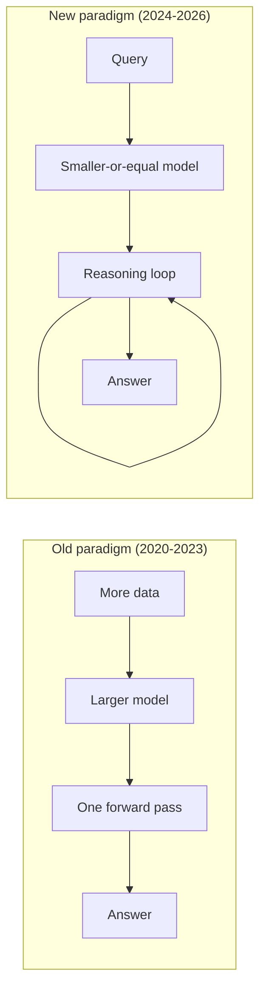

# The Paradigm Shift: Bigger Models vs. Smarter Inference

## Old Paradigm (2020-2023)

- Scale model parameters: 175B, 540B, 1T+
- More training data = better performance
- Chinchilla scaling laws dominate strategy
- Single forward pass per query
- "Emergent abilities" from scale alone
- Cost paid once at training time

## New Paradigm (2024-2026)

- Allocate more compute at inference time
- Let the model "think" before answering
- Chain-of-thought, backtracking, verification
- Variable compute per query complexity
- Reasoning as a learnable skill (via RL)
- Cost scales with problem difficulty

> The frontier moved from "how big is your model?" to "how well does your model think?"

## Sources

- [Training Compute-Optimal Large Language Models — Chinchilla (Hoffmann et al., 2022)](https://arxiv.org/abs/2203.15556)
- [Chain-of-Thought Prompting Elicits Reasoning in LLMs (Wei et al., 2022)](https://arxiv.org/abs/2201.11903)
- [DeepSeek-R1: Incentivizing Reasoning via RL (DeepSeek, 2025)](https://arxiv.org/abs/2501.12948)
- [OpenAI o1 System Card (OpenAI, 2024)](https://arxiv.org/abs/2412.16720)
- [Scaling LLM Test-Time Compute Optimally (Snell et al., 2024)](https://arxiv.org/abs/2408.03314)
