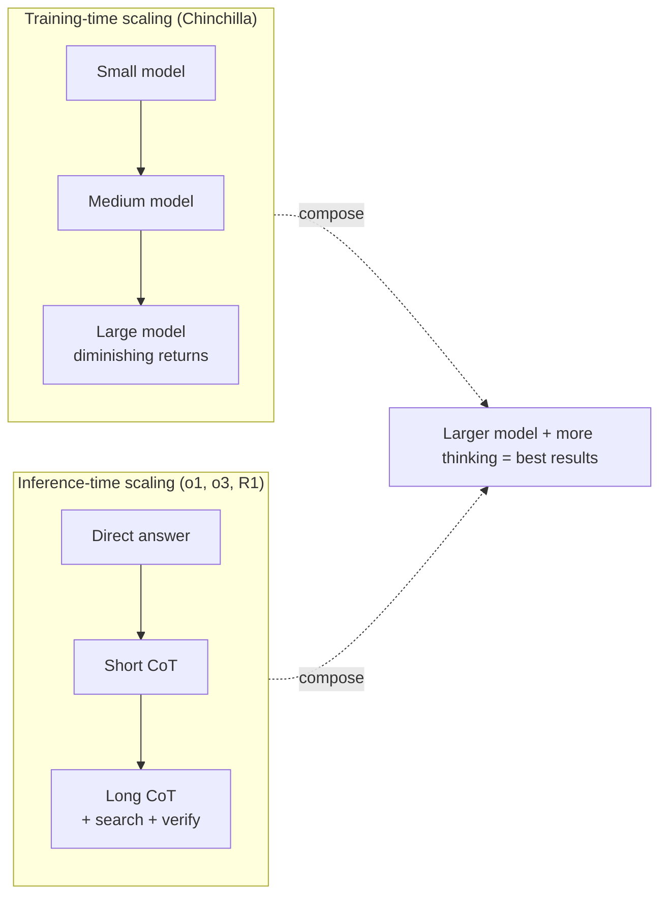

# Training-Time vs. Inference-Time Scaling

### Key observations:

- **Training-time scaling** (Chinchilla laws): diminishing returns as models get larger
- **Inference-time scaling** (o1/o3/R1): new dimension of improvement, orthogonal to model size
- **They compose:** a larger model + more inference compute = best results
- **Practical implication:** a smaller model thinking longer can beat a larger model answering instantly
- OpenAI reported o3 outperforming o1 by spending 10-100x more inference compute on hard problems

### Newer scaling laws (2026):

- **Train-to-Test (T2) scaling laws:** it is compute-optimal to train *smaller* models on more data and then spend the saved budget on inference-time sampling -- shifting compute from training toward test time
- **Kinetics Scaling Law:** adds **KV-cache bandwidth** as an explicit cost variable, recognizing that inference-time scaling is gated by memory bandwidth, not just FLOPs

## Sources

- [Training Compute-Optimal Large Language Models — Chinchilla (Hoffmann et al., 2022)](https://arxiv.org/abs/2203.15556)
- [Scaling LLM Test-Time Compute Optimally (Snell et al., 2024)](https://arxiv.org/abs/2408.03314)
- [Train-to-Test (T2) and Kinetics Scaling Laws (2026)](https://arxiv.org/html/2604.01411v1)
- [OpenAI o1 System Card (OpenAI, 2024)](https://arxiv.org/abs/2412.16720)
