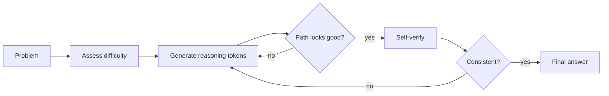

# How Inference-Time Compute Works: Think Longer, Not Bigger

### The mechanism:

1. **Problem arrives** -- model assesses difficulty
2. **Reasoning tokens generated** -- internal chain-of-thought (can be 1K-100K+ tokens)
3. **Search and backtracking** -- model explores paths, prunes bad ones
4. **Self-verification** -- model checks consistency, re-derives results
5. **Final answer produced** -- only after deliberation is complete

### Concrete numbers:

- Simple factual question: ~50 reasoning tokens, ~0.5s
- Math competition problem: ~10,000 reasoning tokens, ~30s
- ARC-AGI hard task (o3): ~100,000+ reasoning tokens, ~minutes
- Cost scales linearly with reasoning tokens generated

### Why reinforcement learning matters:

- Models are trained with RL (e.g., GRPO in DeepSeek R1) to produce *useful* reasoning
- Reward signal: did the final answer turn out correct?
- The model learns to allocate effort proportional to problem difficulty
- Without RL, chain-of-thought is often superficial or repetitive

## Sources

- [DeepSeek-R1: Incentivizing Reasoning via RL (DeepSeek, 2025)](https://arxiv.org/abs/2501.12948)
- [Scaling LLM Test-Time Compute Optimally (Snell et al., 2024)](https://arxiv.org/abs/2408.03314)
- [OpenAI o1 System Card (OpenAI, 2024)](https://arxiv.org/abs/2412.16720)
