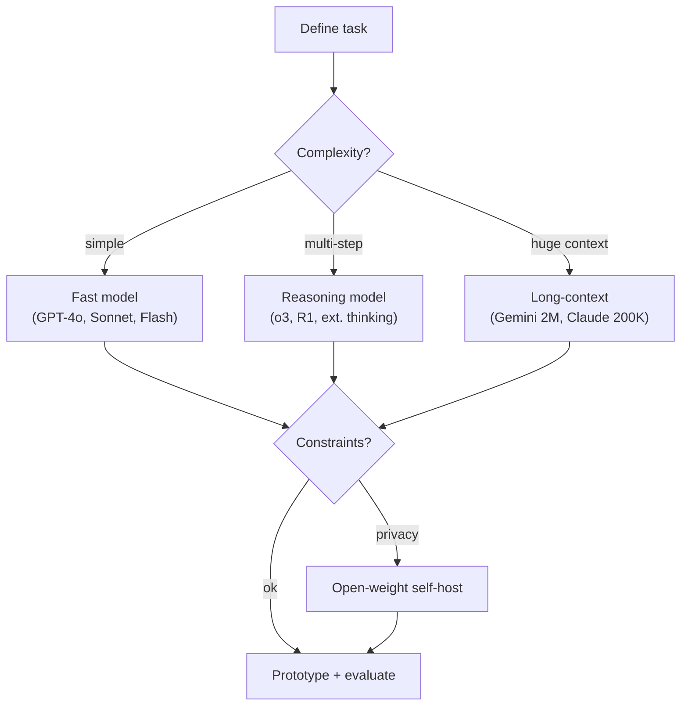

# Decision Framework: Choosing the Right Model

## Step 1: Define the Task

- Classification, generation, reasoning, code, multimodal?
- What accuracy threshold is acceptable?
- Is the task well-represented in training data, or novel?

## Step 2: Assess Complexity

- Simple pattern matching -> standard model (GPT-4o, Sonnet, Flash)
- Multi-step reasoning required -> reasoning model (o3, R1, extended thinking)
- Massive context needed -> long-context model (Gemini 2M, Claude 200K)

## Step 3: Check Constraints

- **Latency:** real-time (<1s) vs. async (seconds-minutes acceptable)?
- **Cost:** high-volume (need cheap) vs. low-volume (can afford premium)?
- **Privacy:** can data leave your infrastructure? If not -> open-weight models
- **Compliance:** regulatory requirements for model provenance?

## Step 4: Prototype and Evaluate

- Start with the cheapest model that might work
- Build domain-specific evals before committing
- Test with real data, not benchmarks
- Consider compound systems: cheap model for easy tasks, expensive for hard ones
