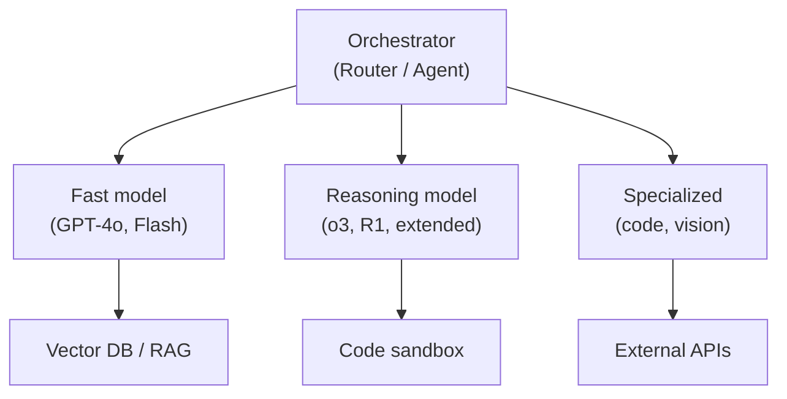

# Compound AI Systems

### Key principles:
- **Route by difficulty:** cheap model for easy queries, expensive model for hard ones
- **Compose capabilities:** combine reasoning + retrieval + code execution
- **Verify outputs:** use one model to check another's work
- **The system is the product**, not any single model call

## Sources

- [The Shift from Models to Compound AI Systems (Zaharia et al., 2024)](https://bair.berkeley.edu/blog/2024/02/18/compound-ai-systems/)
