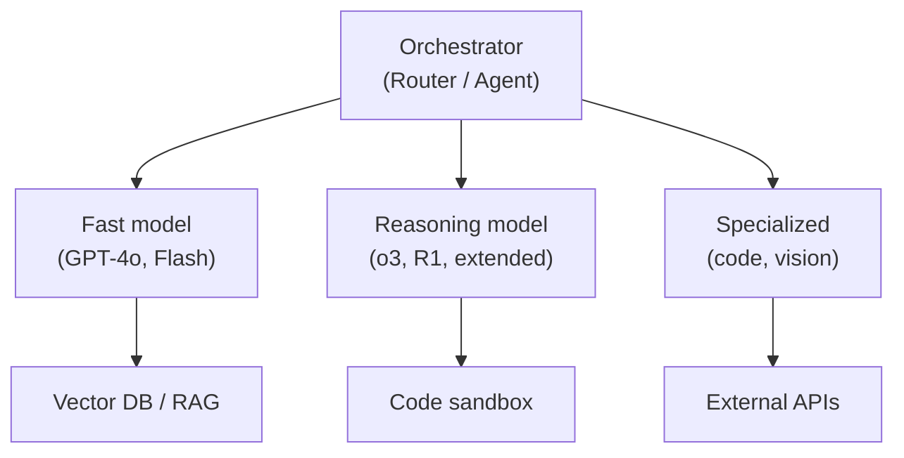

# Compound AI Systems

### Key principles:
- **Route by difficulty:** cheap model for easy queries, expensive model for hard ones
- **Route across vendors at runtime:** production teams treat model selection as a *runtime decision*, routing to GPT-5.4 for agentic execution, Claude Opus 4.7 for long reasoning, and Gemini 3.1 Pro for multimodal / large-context work
- **Compose capabilities:** combine reasoning + retrieval + code execution
- **Verify outputs:** use one model to check another's work
- **The system is the product**, not any single model call

## Sources

- [The Shift from Models to Compound AI Systems (Zaharia et al., 2024)](https://bair.berkeley.edu/blog/2024/02/18/compound-ai-systems/)
- [Multi-Model Orchestration: GPT-5.4, Claude Opus 4.7, Gemini 3.1 (ALM Corp, 2026)](https://almcorp.com/blog/multi-model-orchestration-gpt-5-4-claude-opus-4-7-gemini-3-1/)
