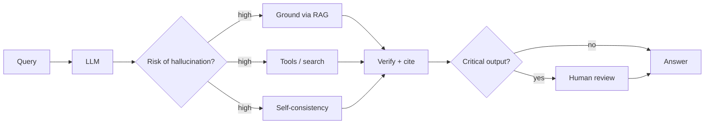

# The Hallucination Problem

### Reasoning helps but does not solve it:

- **Standard LLMs** hallucinate ~15-25% of factual claims (varies by domain and model)
- **Reasoning models** reduce hallucination through self-verification, but still fail
- o1/R1 can produce "confidently wrong" reasoning chains -- the logic looks sound but premises are fabricated

### Why hallucinations persist:

- Models generate plausible continuations, not verified facts
- Training data contains errors, contradictions, and outdated information
- Reasoning over wrong premises produces wrong conclusions -- with high confidence
- No built-in "I don't know" mechanism (though instruction tuning helps)

### Mitigation strategies (we will cover these in depth):

- **Retrieval-Augmented Generation (RAG):** ground responses in retrieved documents
- **Citations and attribution:** force models to cite sources, verify against them
- **Tool use:** let the model look things up rather than relying on parametric memory
- **Self-consistency:** sample multiple times, flag disagreements
- **Human-in-the-loop:** design systems where humans verify critical outputs

> Hallucination is not a bug that will be patched -- it is a fundamental property of generative models that must be engineered around.

## Sources

- [FActScore: Fine-grained Atomic Evaluation of Factual Precision (Min et al., 2023)](https://arxiv.org/abs/2305.14251)
- [OpenAI o1 System Card (OpenAI, 2024)](https://arxiv.org/abs/2412.16720)
