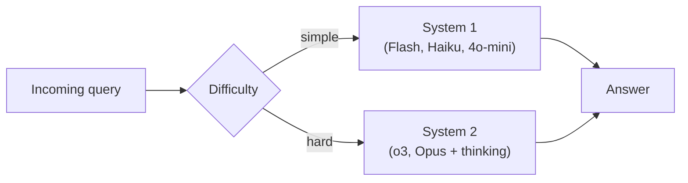

# Cost and Latency Tradeoffs

## Cheap & Fast (System 1)

- GPT-4o mini: ~$0.15/$0.60 per 1M tokens
- Gemini 2.0 Flash: ~$0.10/$0.40 per 1M tokens
- Claude 3.5 Haiku: ~$0.80/$4.00 per 1M tokens
- Latency: 100-500ms for typical responses
- **Use for:** classification, extraction, summarization, simple Q&A, routing
- 1M API calls/day is financially viable

## Expensive & Slow (System 2)

- o3 (high compute): ~$10/$40 per 1M tokens + reasoning tokens
- Claude 4 Opus w/ extended thinking: ~$15/$75 per 1M tokens
- Reasoning tokens can be 10-100x the output length
- Latency: 10s-120s for complex problems
- **Use for:** math, code generation, complex analysis, planning, research
- 1M calls/day would cost $10,000-$100,000+

> The winning architecture in 2026: route easy tasks to cheap models, hard tasks to reasoning models. Pay for thinking only when you need it.

## Sources

- [OpenAI API Pricing](https://openai.com/api/pricing/)
- [Anthropic API Pricing](https://platform.claude.com/docs/en/about-claude/pricing)
- [Google AI Gemini API Pricing](https://ai.google.dev/gemini-api/docs/pricing)
