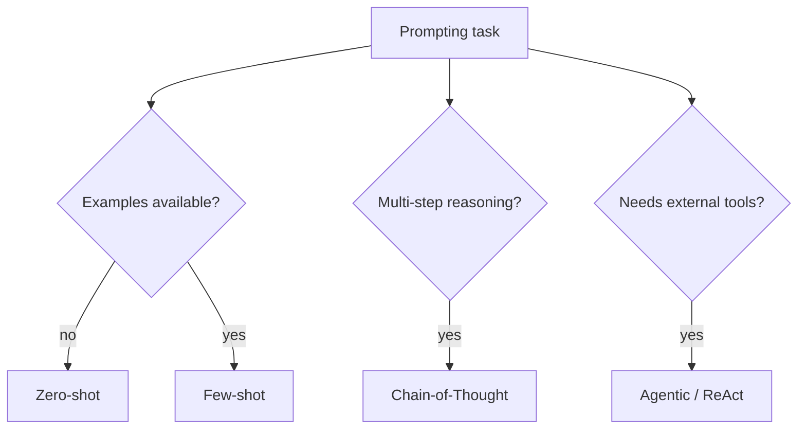

# Taxonomy of Prompting Strategies



## Zero-Shot

No examples provided. Relies entirely on the model's pretraining.

```
Classify the sentiment: "The battery
life is terrible but the screen
is gorgeous."
```

Best for: simple, well-defined tasks the model has seen in training.

## Few-Shot

Provide 2-5 examples to establish the input-output pattern.

```
Review: "Love it!" -> positive
Review: "Broke after a week" -> negative
Review: "It's okay I guess" -> ?
```

Best for: tasks with nuanced output formats or domain-specific conventions.

## Chain-of-Thought

Force explicit reasoning steps before the final answer.

```
Q: If a train travels 120 miles in
   2 hours, what is its speed in km/h?
A: Let's solve step by step...
```

Best for: multi-step reasoning, math, logic, complex analysis.

## Agentic / ReAct

Interleave reasoning with tool use and observation in a loop.

```
Thought: I need current stock price.
Action: search("AAPL stock price")
Observation: $185.42
Thought: Now I can calculate...
```

Best for: tasks requiring external data, multi-step workflows, real-world actions.

## Sources

- [Chain-of-Thought Prompting Elicits Reasoning in Large Language Models (Wei et al., 2022)](https://arxiv.org/abs/2201.11903)
- [ReAct: Synergizing Reasoning and Acting in Language Models (Yao et al., 2022)](https://arxiv.org/abs/2210.03629)
