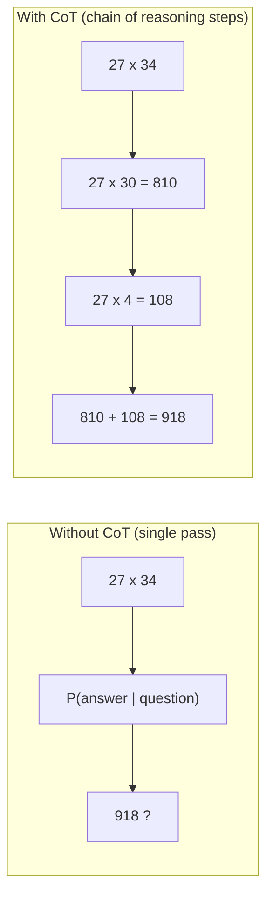

# Why CoT Works: Decomposition Enables Reasoning

The model cannot perform complex computation in a single forward pass. Each generated token is one "compute step." CoT converts serial reasoning into sequential token generation.

## The Mechanism

- **Expanded compute budget**: each reasoning token is an additional forward pass the model gets to use
- **Working memory via context**: earlier steps remain in the context window as scratchpad
- **Error localization**: if step 2 is wrong, the error is visible and can be caught
- **Compositional generalization**: familiar sub-steps combine to solve novel problems

## Sources

- [Chain-of-Thought Prompting Elicits Reasoning in Large Language Models (Wei et al., 2022)](https://arxiv.org/abs/2201.11903)
