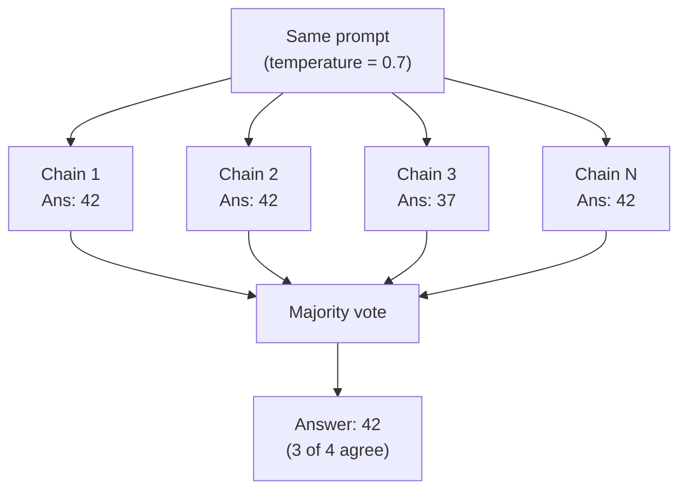

# Self-Consistency: Multiple Paths, Majority Vote

Wang et al. (2022): Sample multiple reasoning chains at temperature > 0, then take the majority answer. Different reasoning paths that converge on the same answer signal correctness.

## Key Properties

- **N = 5-10** samples is typically sufficient for arithmetic and commonsense tasks
- **Diverse reasoning paths** → higher confidence when they agree
- **Cost tradeoff**: N times the inference cost, but significantly higher accuracy
- GSM8K: CoT alone ~57% → Self-Consistency ~74% (PaLM 540B)
- Works with any CoT variant as the base sampling strategy

## Sources

- [Self-Consistency Improves Chain of Thought Reasoning in Language Models (Wang et al., 2022)](https://arxiv.org/abs/2203.11171)
