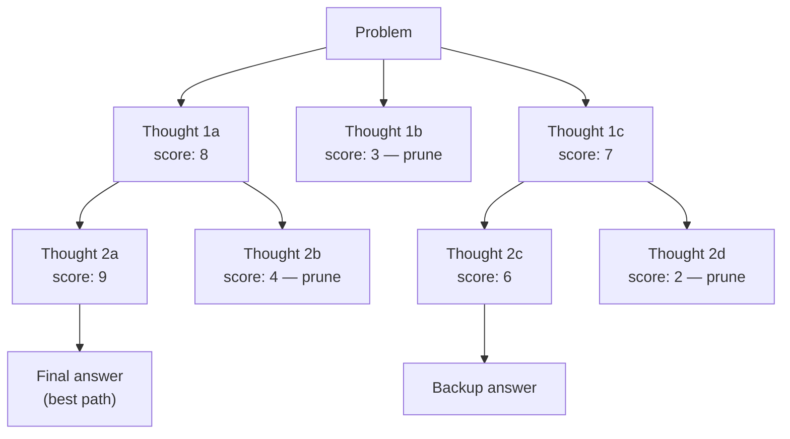

# Tree of Thoughts: Branching Exploration with Backtracking

Yao et al. (2023): Generalize CoT from a single chain to a tree. At each step, generate multiple candidate next-steps, evaluate them, and prune or backtrack.

## How It Works

1. **Generate**: produce multiple candidate thoughts at each reasoning step
2. **Evaluate**: score each thought for promise (via LLM self-evaluation or heuristic)
3. **Search**: use BFS or DFS to explore the tree; prune low-scoring branches
4. **Backtrack**: if a path leads to contradiction, return to last branch point

## When to Use ToT

- Tasks with **dead ends** (e.g., Game of 24, crossword puzzles, planning)
- When the search space is **small enough** to explore (tens of branches, not thousands)
- Cost: 10-100x a single CoT call — reserve for high-value reasoning tasks

## Sources

- [Tree of Thoughts: Deliberate Problem Solving with Large Language Models (Yao et al., 2023)](https://arxiv.org/abs/2305.10601)
