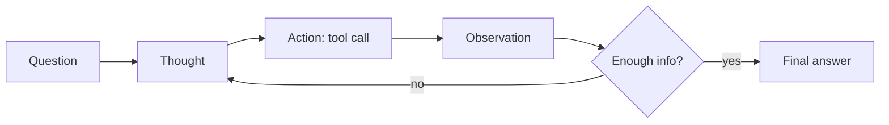

# ReAct: Reasoning + Acting

Yao et al. (2022): Interleave chain-of-thought reasoning with tool use. The model **thinks** about what to do, **acts** using an external tool, **observes** the result, and repeats.



## Why ReAct?

Pure CoT fails when the model needs **external information** or must **take actions** in the world. ReAct bridges reasoning and grounding.

```
Question: "What is the population of the country where the Eiffel Tower is located?"

# Pure CoT — may hallucinate the population figure
Thought: The Eiffel Tower is in Paris, France. France's population is
approximately 67 million. Answer: 67 million. (outdated? made up?)

# ReAct — grounds reasoning in real data
Thought 1: I need to find which country the Eiffel Tower is in.
Action 1: search("Eiffel Tower location")
Observation 1: The Eiffel Tower is located in Paris, France.
Thought 2: Now I need the current population of France.
Action 2: search("France population 2025")
Observation 2: France population 2025: 68.4 million (UN estimate)
Thought 3: I have the answer grounded in a real source.
Action 3: finish("68.4 million")
```

## Key Properties

- **Grounded**: answers are traceable to external sources
- **Auditable**: the full reasoning + action trace is logged
- **Recoverable**: if an action fails, the model can reason about a fallback
- **Composable**: tools can be search, code execution, APIs, databases, or any callable function

## Sources

- [ReAct: Synergizing Reasoning and Acting in Language Models (Yao et al., 2022)](https://arxiv.org/abs/2210.03629)
