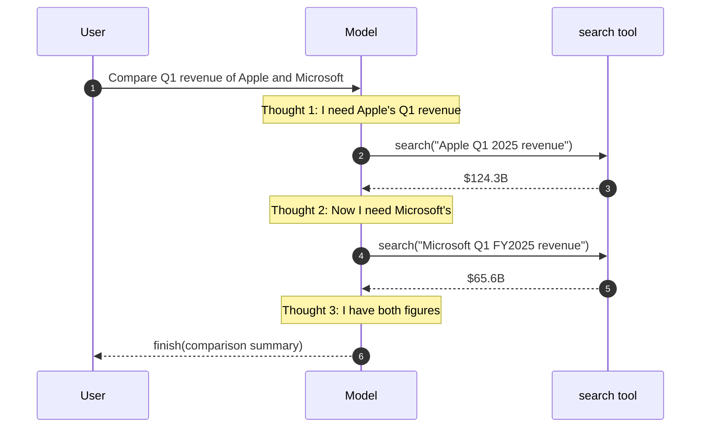
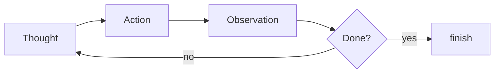

# ReAct Execution Flow

## The Loop

**Thought** (reason about state) → **Action** (call a tool) → **Observation** (receive result) → repeat until **finish**.

The model decides **when to stop** — it calls `finish()` when it has enough information. If an action fails, Thought re-plans.

## Sources

- [ReAct: Synergizing Reasoning and Acting in Language Models (Yao et al., 2022)](https://arxiv.org/abs/2210.03629)
