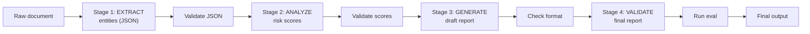

# Prompt Chaining: Decompose Complex Tasks into Pipeline Stages

Instead of one monolithic prompt, break the task into a sequence of focused LLM calls. Each stage has a clear input/output contract.

## Design Principles

- **Single responsibility**: each stage does one thing well
- **Typed interfaces**: JSON schemas between stages make debugging easy
- **Checkpoint validation**: catch errors between stages, not at the end
- **Independent optimization**: tune each stage's prompt separately
- **Conditional branching**: route to different stage-2 prompts based on stage-1 output

## Example: Research Paper Summarization Pipeline

1. **Extract**: pull out title, abstract, key claims, methodology, results → JSON
2. **Evaluate**: assess methodology strength, novelty, limitations → structured scores
3. **Synthesize**: generate a 200-word summary incorporating the evaluation
4. **Validate**: check summary accuracy against extracted claims, flag hallucinations

## Advantages Over Monolithic Prompts

- 40-60% fewer errors on complex tasks (empirical observation across production systems)
- Each stage can use a different model (cheap model for extraction, strong model for analysis)
- Failures are isolated — retry one stage instead of the whole pipeline
