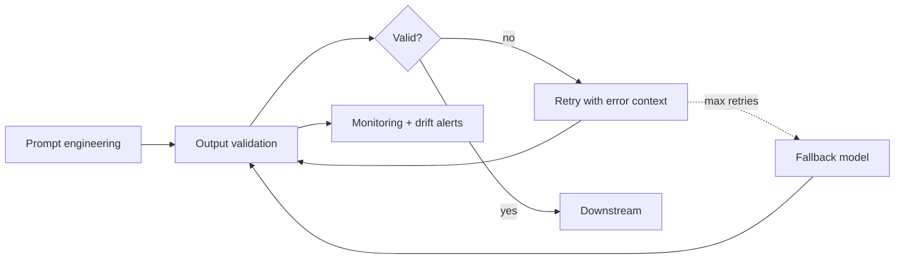

# The Reliability Problem: Same Prompt, Different Results

LLMs are stochastic systems. Even at temperature 0, API providers may change model versions, routing, and quantization. Production prompts must be engineered for reliability.

## Sources of Non-Determinism

- **Temperature > 0**: intentional randomness in token sampling
- **Model updates**: providers silently update model weights, changing behavior
- **Input variation**: slight rephrasing of user input triggers different reasoning paths
- **Context sensitivity**: earlier conversation turns influence later outputs
- **Infrastructure**: load balancing across different hardware, batching effects

## A Production Horror Story

```
# This prompt worked perfectly for 3 months, then broke overnight:

SYSTEM: Extract the dollar amount from the invoice text.
        Return only the number.

# Before model update:  "Total: $1,234.56" → "1234.56"  ✓
# After model update:   "Total: $1,234.56" → "$1,234.56" ✗
# After another update: "Total: $1,234.56" → "The dollar amount is 1234.56" ✗
```

## The Reliability Stack

You need **defense in depth**, not just a good prompt:

1. **Prompt engineering** — clear instructions, examples, format specs
2. **Output validation** — structural checks on every response
3. **Retry logic** — re-prompt on validation failure with error context
4. **Fallback models** — route to backup model if primary fails
5. **Monitoring** — track output distributions, alert on drift



## Prompt Stability as a CI Concern

In 2026, teams treat prompt stability the way they treat code stability:

- **Pin model versions** so a silent provider update can't change behavior under you
- **Run regression tests** on every prompt or model change, asserting against **golden outputs**
- **DSPy signatures** make this tractable: prompts become typed, versioned program components you can re-compile and re-test rather than fragile strings

## Sources

- [Automatic Prompt Optimization with DSPy: Self-Tuning Agent Pipelines (Muthu, 2026)](https://dspy.ai/learn/optimization/optimizers/)
