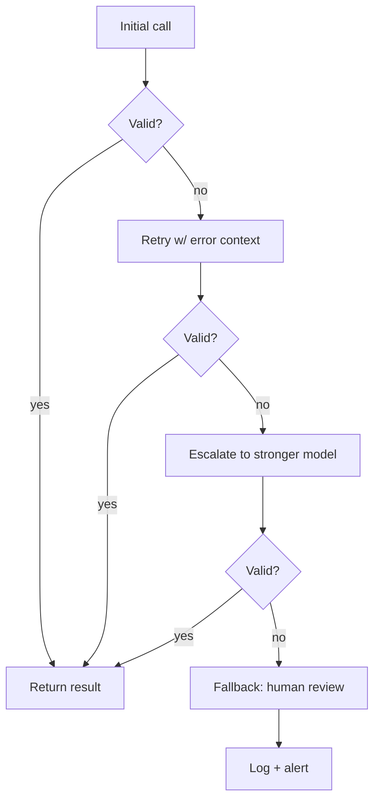

# Retry and Fallback Patterns: Graceful Degradation



## Step 1: Initial Call

Send prompt to primary model (e.g., Claude Sonnet). Parse and validate the response against the expected schema.

```python
response = call_llm(model="claude-sonnet", prompt=prompt)
result = validate(response)
if result.valid:
    return result.data
```

## Step 2: Retry with Error Context

If validation fails, re-prompt with the error message appended. The model can often self-correct when told what went wrong.

```python
retry_prompt = f"""{original_prompt}

Your previous response was invalid:
{result.error_message}

Please fix the issue and respond again.
Respond ONLY with valid JSON matching the schema."""

response = call_llm(model="claude-sonnet", prompt=retry_prompt)
```

## Step 3: Escalate to Stronger Model

If retries exhaust (typically max 2-3), route to a more capable model.

```python
if retry_count >= MAX_RETRIES:
    response = call_llm(model="claude-opus", prompt=original_prompt)
```

## Step 4: Structured Fallback

If all LLM calls fail, return a safe default or route to human review. Never fail silently.

```python
if all_attempts_failed:
    return FallbackResult(
        status="needs_human_review",
        raw_outputs=collected_responses,
        reason="All LLM attempts failed validation"
    )
```

## Step 5: Log and Alert

Every fallback triggers an alert. Aggregate failure rates to detect model degradation early.

```python
metrics.increment("llm.fallback_triggered",
    tags={"task": task_name, "model": model_name})
if fallback_rate > THRESHOLD:
    alert_oncall("LLM fallback rate elevated")
```
