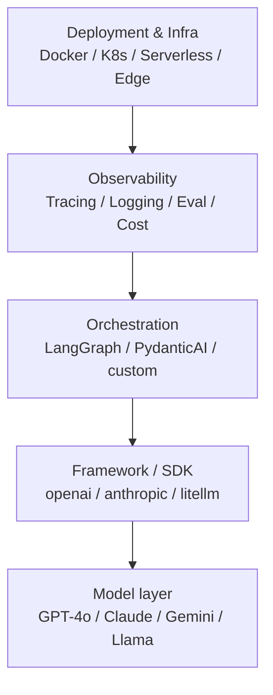

# The AI Application Stack

Every AI application has these layers, whether you make them explicit or not.

**Key insight**: You can swap layers independently. A good architecture keeps each layer replaceable.

## Sources

- [LangGraph Documentation](https://langchain-ai.github.io/langgraph/)
- [PydanticAI Documentation](https://ai.pydantic.dev/)
- [OpenAI API Documentation](https://platform.openai.com/docs)
- [Anthropic API Documentation](https://docs.anthropic.com)
- [LiteLLM — Unified LLM API (GitHub)](https://github.com/BerriAI/litellm)
