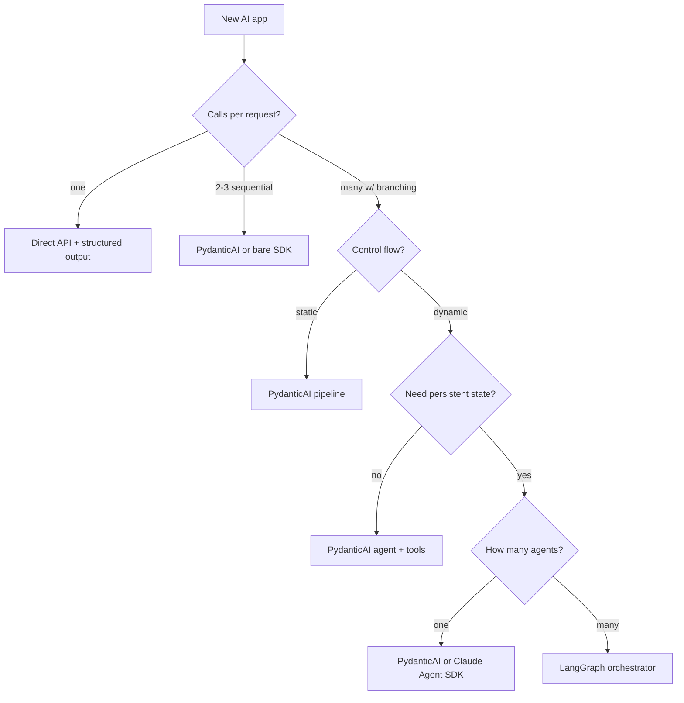

# Decision Map for Choosing Your Stack

## Step 1: How many LLM calls per user request?

- **One call** → Direct API with structured output. No framework needed.
- **2-3 sequential calls** → Simple chain. Consider PydanticAI or bare SDK.
- **Many calls with branching** → You need orchestration. Continue to Step 2.

## Step 2: Is the control flow dynamic or static?

- **Static** (always the same steps) → Pipeline pattern. PydanticAI or simple functions.
- **Dynamic** (model decides next step) → Agent pattern. Continue to Step 3.

## Step 3: Do you need persistent state across turns?

- **No** (stateless request/response) → PydanticAI agent with tools.
- **Yes** (multi-turn, checkpointing, human-in-the-loop) → LangGraph with state persistence.

## Step 4: How many agents coordinate?

- **Single agent** → PydanticAI or Claude Agent SDK.
- **Multiple agents** → LangGraph orchestrator or custom coordination layer.

**Rule of thumb**: Start with the simplest option. Upgrade when you hit a real limitation, not a hypothetical one.
