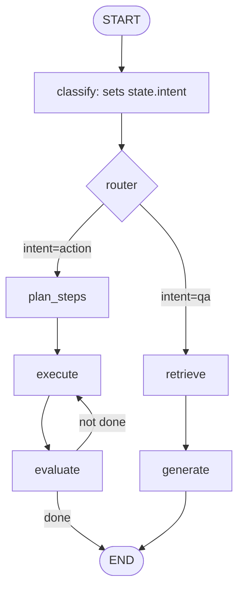

# LangGraph Deep Dive

## State Machine Architecture



## Core Concepts

```python
from langgraph.graph import StateGraph, START, END
from typing import TypedDict, Literal

class State(TypedDict):
    query: str
    intent: str
    context: list[str]
    response: str

graph = StateGraph(State)
graph.add_node("classify", classify_intent)
graph.add_node("retrieve", retrieve_docs)
graph.add_node("generate", generate_response)

graph.add_edge(START, "classify")
graph.add_conditional_edges("classify", route_by_intent)
graph.add_edge("retrieve", "generate")
graph.add_edge("generate", END)

app = graph.compile(checkpointer=MemorySaver())
```

## Sources

- [LangGraph Documentation](https://langchain-ai.github.io/langgraph/)
- [LangGraph StateGraph API Reference](https://langchain-ai.github.io/langgraph/)
