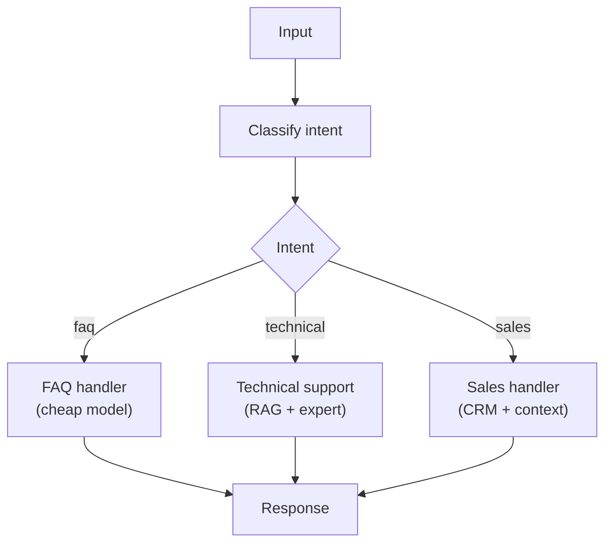

# Pattern 2: Router

Classify the input, then route to specialized handlers.



## Why Route?

- Use **cheap models** (GPT-4o-mini) for simple queries, **expensive models** for complex ones
- Specialized system prompts per category improve quality dramatically
- Route to **different tools** based on intent — not every query needs every tool

## Implementation

```python
from pydantic_ai import Agent
from enum import Enum

class Intent(str, Enum):
    FAQ = "faq"
    TECHNICAL = "technical"
    SALES = "sales"

classifier = Agent("openai:gpt-4o-mini", result_type=Intent,
    system_prompt="Classify the user's intent.")

handlers = {
    Intent.FAQ: faq_agent,
    Intent.TECHNICAL: technical_agent,
    Intent.SALES: sales_agent,
}

intent = (await classifier.run(user_input)).data
response = await handlers[intent].run(user_input)
```

**Cost**: 2 LLM calls (classifier is cheap). **Latency**: 1-3s. **Big win**: Cost optimization + quality.
