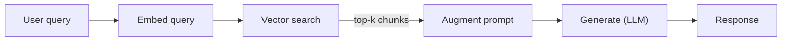

# Pattern 3: RAG Pipeline

Retrieve relevant context, augment the prompt, then generate.



## Key Decisions in RAG

- **Chunking strategy**: Fixed-size, semantic, document-structure-aware
- **Embedding model**: OpenAI `text-embedding-3-small`, Cohere, open-source (BGE, E5)
- **Vector store**: Postgres+pgvector (simple), Pinecone/Weaviate/Qdrant (scale)
- **Retrieval**: Top-k similarity, hybrid (BM25 + vector), reranking with Cohere/ColBERT
- **Context window**: Stuff all chunks vs. map-reduce vs. iterative refinement

## Minimal RAG Example

```python
# Retrieval
chunks = await vector_store.similarity_search(query, k=5)
context = "\n---\n".join(c.text for c in chunks)

# Augmented generation
agent = Agent("openai:gpt-4o", system_prompt=f"""
Answer based on the provided context. Cite sources.
Context:
{context}
""")
result = await agent.run(query)
```

**Gotcha**: RAG quality depends 80% on retrieval quality, 20% on generation. Invest in chunking and retrieval before prompt engineering.

## Sources

- [pgvector — Vector Similarity Search for Postgres (GitHub)](https://github.com/pgvector/pgvector)
- [Pinecone Vector Database](https://www.pinecone.io/)
- [Weaviate Vector Database](https://weaviate.io/)
- [Qdrant Vector Search Engine](https://qdrant.tech/)
- [Cohere Rerank API](https://cohere.com/rerank)
- [ColBERT: Efficient and Effective Passage Search (Khattab & Zaharia, 2020)](https://arxiv.org/abs/2004.12832)
- [OpenAI Embeddings API](https://platform.openai.com/docs)
