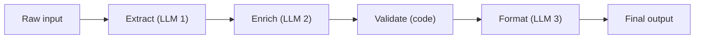

# Pattern 5: Multi-Step Pipeline

A deterministic chain of transformations, each using an LLM.



## Key Difference from Agent Loop

- **Pipeline**: You decide the steps at design time. Steps always run in order.
- **Agent loop**: The model decides the steps at runtime.

## Real Example: Document Processing Pipeline

```python
from pydantic import BaseModel
from pydantic_ai import Agent

class ExtractedData(BaseModel):
    entities: list[str]
    dates: list[str]
    amounts: list[float]

class EnrichedData(BaseModel):
    entities: list[dict]  # With metadata from DB lookup
    timeline: list[dict]
    total_amount: float

# Step 1: Extract structured data
extractor = Agent("openai:gpt-4o-mini", result_type=ExtractedData,
    system_prompt="Extract entities, dates, and monetary amounts.")

# Step 2: Enrich with external data (code, not LLM)
async def enrich(data: ExtractedData) -> EnrichedData:
    entities = [await lookup_entity(e) for e in data.entities]
    return EnrichedData(entities=entities, ...)

# Step 3: Generate summary
summarizer = Agent("openai:gpt-4o", result_type=str,
    system_prompt="Write an executive summary from the enriched data.")

# Pipeline execution
extracted = (await extractor.run(document_text)).data
enriched = await enrich(extracted)
summary = (await summarizer.run(str(enriched))).data
```

**Pro tip**: Mix LLM steps with deterministic code steps. Not every transformation needs an LLM.
