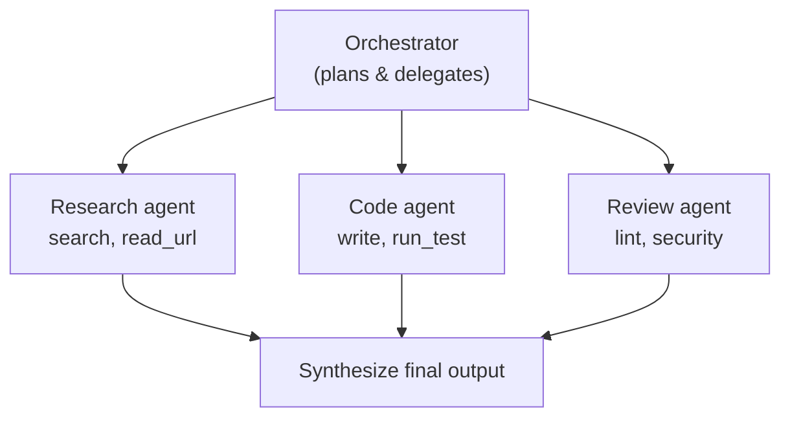

# Pattern 6: Orchestrator

A coordinator that delegates to multiple agents or sub-chains.



## LangGraph Implementation

```python
from langgraph.graph import StateGraph, START, END

class OrchestratorState(TypedDict):
    task: str
    plan: list[str]
    research_output: str
    code_output: str
    review_output: str
    final_output: str

graph = StateGraph(OrchestratorState)
graph.add_node("plan", plan_subtasks)
graph.add_node("research", run_research_agent)
graph.add_node("code", run_code_agent)
graph.add_node("review", run_review_agent)
graph.add_node("synthesize", combine_outputs)

graph.add_edge(START, "plan")
# Fan out to parallel agents
graph.add_edge("plan", "research")
graph.add_edge("plan", "code")
graph.add_edge("research", "review")
graph.add_edge("code", "review")
graph.add_edge("review", "synthesize")
graph.add_edge("synthesize", END)
```

## When to Use

- Tasks that naturally decompose into **independent sub-tasks**
- When different sub-tasks need **different tools or models**
- When you want **parallel execution** for speed

**Complexity warning**: This is the most complex pattern. Each sub-agent is its own agent loop. Debug carefully.

## Sources

- [LangGraph Documentation](https://langchain-ai.github.io/langgraph/)
- [Anthropic Building Effective Agents](https://www.anthropic.com/research/building-effective-agents)
