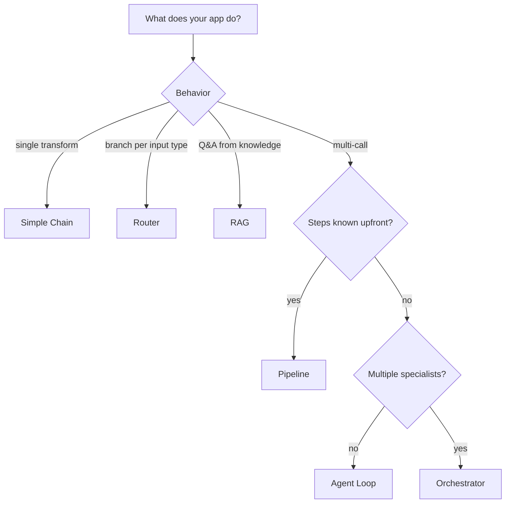

# Choosing the Right Pattern

## Start Here: What does your application do?

- **Single transformation** (classify, extract, summarize) → **Simple Chain** (Pattern 1)
- **Different behavior per input type** → **Router** (Pattern 2)
- **Answer questions from a knowledge base** → **RAG** (Pattern 3)

## If you need multiple LLM calls...

- **Steps known at design time** → **Pipeline** (Pattern 5)
- **Model decides what to do next** → **Agent Loop** (Pattern 4)
- **Multiple specialized agents** → **Orchestrator** (Pattern 6)

## The Complexity-Value Tradeoff

| Pattern | LLM Calls | Latency | Cost | Complexity |
|---------|-----------|---------|------|------------|
| Simple Chain | 1 | Low | $ | Trivial |
| Router | 2 | Low | $ | Low |
| RAG | 1-2 | Medium | $$ | Medium |
| Pipeline | N (fixed) | Medium | $$ | Medium |
| Agent Loop | N (variable) | High | $$$ | High |
| Orchestrator | N*M | Very High | $$$$ | Very High |

## The Golden Rule

**Use the simplest pattern that solves your problem.** Complexity is not a feature.

- 80% of production LLM apps are Pattern 1 or Pattern 2
- Most apps that think they need agents actually need a pipeline
- If you can avoid giving the model control flow decisions, do it
