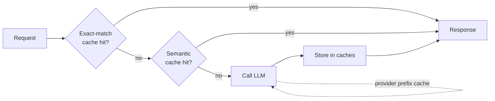

# Caching Strategies

Caching is the single biggest lever for reducing LLM costs and latency.

## Exact Match Cache

The simplest approach. Hash the prompt, cache the response.

- **When**: Identical prompts repeat often (classification, extraction on templates)
- **Implementation**: Redis or in-memory dict keyed by `hash(model + prompt)`
- **Hit rate**: High for structured/templatized inputs, low for free-form chat
- **TTL**: Hours to days depending on freshness requirements

## Semantic Cache

Embed the prompt, find similar cached prompts within a threshold.

- **When**: Users ask similar questions in different words
- **Implementation**: Vector store of prompt embeddings, cosine similarity threshold (0.95+)
- **Risk**: Returning a cached answer to a subtly different question — tune threshold carefully
- **Tools**: GPTCache, Redis with vector search, custom with pgvector

## Prompt Caching (Provider-Level)

Anthropic and OpenAI cache long prompt prefixes server-side.

- **Anthropic**: Automatic for prompts sharing a prefix. Up to 90% cost reduction on cached tokens.
- **OpenAI**: Automatic prefix caching on prompts > 1024 tokens. 50% discount on cached input tokens.
- **When**: System prompts, large context documents, or RAG contexts that repeat across calls
- **Action**: Structure prompts so the static part (system prompt, context) comes first

## KV Cache (Self-Hosted)

For self-hosted models, the attention KV cache avoids recomputing previous tokens.

- **When**: Running Llama, Mistral, etc. on your own GPUs
- **Implementation**: vLLM, TGI handle this automatically with PagedAttention
- **Impact**: 2-4x throughput improvement
- **Relevance**: Only matters if you self-host; API providers handle this for you

## Sources

- [Anthropic Prompt Caching Documentation](https://docs.anthropic.com)
- [OpenAI Prompt Caching Guide](https://platform.openai.com/docs/guides/prompt-caching)
- [GPTCache — Semantic Cache for LLMs (GitHub)](https://github.com/zilliztech/GPTCache)
- [vLLM — High-Throughput LLM Serving (GitHub)](https://github.com/vllm-project/vllm)
- [PagedAttention: Efficient Memory Management for LLM Serving (Kwon et al., 2023)](https://arxiv.org/abs/2309.06180)
