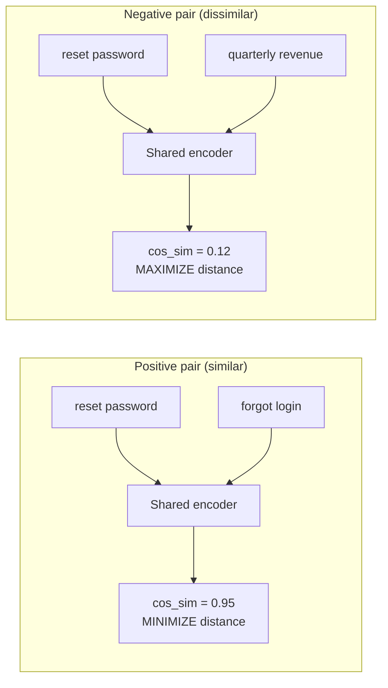

# How Embedding Models Work

Modern embedding models are trained with **contrastive learning**: push similar pairs together, pull dissimilar pairs apart.

### Key Training Techniques

- **InfoNCE Loss**: for each positive pair, treat all other batch items as negatives
- **Hard Negative Mining**: select negatives that are close but semantically different (e.g., same topic, different answer)
- **Matryoshka Representation Learning (MRL)**: train embeddings that are useful at multiple dimensionalities (e.g., 256, 512, 1024, 3072)
- **Instruction tuning**: prepend task-specific instructions ("Represent this document for retrieval:") to improve task performance

### Inference

At query time, you pass text through the encoder once and get a fixed-size vector. No pairwise comparison needed -- just compute similarity against stored vectors.

## Sources

- [Representation Learning with Contrastive Predictive Coding — InfoNCE (van den Oord et al., 2018)](https://arxiv.org/abs/1807.03748)
- [Matryoshka Representation Learning (Kusupati et al., 2022)](https://arxiv.org/abs/2205.13147)
