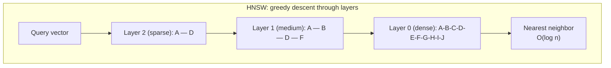
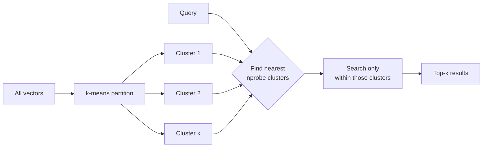

# How Vector Search Works

Exact nearest-neighbor search is O(n) -- too slow at scale. Approximate Nearest Neighbor (ANN) algorithms trade a small accuracy loss for massive speed gains.





```
  Product Quantization (PQ)
  ==========================

  Original vector (1024 dims):
  [0.12, 0.45, -0.33, 0.78, ..., 0.56]

  Split into 8 sub-vectors of 128 dims each:
  [sub1] [sub2] [sub3] [sub4] [sub5] [sub6] [sub7] [sub8]

  Quantize each sub-vector to nearest centroid ID:
  [ 42 ] [ 17 ] [  8 ] [231] [105] [ 63 ] [ 99 ] [  5 ]

  Memory: 1024 floats (4KB) --> 8 bytes
  ~500x compression with ~5% recall loss
```

### Performance Characteristics

| Algorithm | Build Time | Query Time | Memory | Recall@10 |
|-----------|-----------|------------|--------|-----------|
| Flat (exact) | O(1) | O(n) | 1x | 100% |
| IVF | O(n) | O(n/k) | 1x | 95-99% |
| HNSW | O(n log n) | O(log n) | 1.5-2x | 97-99.5% |
| IVF-PQ | O(n) | O(n/k) | 0.01-0.1x | 90-95% |

## Sources

- [Efficient and Robust Approximate Nearest Neighbor Search Using HNSW Graphs (Malkov & Yashunin, 2018)](https://arxiv.org/abs/1603.09320)
- [FAISS — A Library for Efficient Similarity Search (Facebook Research)](https://github.com/facebookresearch/faiss)
