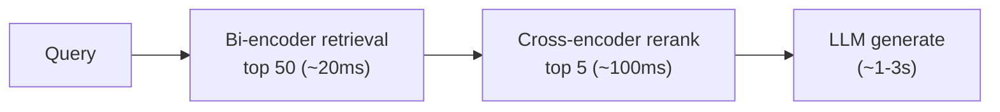

# Reranking: From Recall to Precision

Embedding-based retrieval casts a wide net (high recall). Reranking narrows it to the most relevant results (high precision).

### Why Reranking Works

- **Bi-encoders** (embedding models): encode query and document independently -- fast but lose cross-attention
- **Cross-encoders** (rerankers): process query AND document together -- slow but capture fine-grained relevance
- Reranking is a **two-stage** approach: retrieve 50-100 candidates with bi-encoder, rerank to top 5-10 with cross-encoder

### Reranking Models

| Model | Type | Latency | Quality | Notes |
|-------|------|---------|---------|-------|
| Cohere Rerank 3.5 | API cross-encoder | ~100ms/batch | Very high | Best API option, multi-lingual |
| Jina Reranker v2 | API cross-encoder | ~80ms/batch | High | Cost-effective alternative |
| bge-reranker-v2-m3 | Open-source cross-encoder | Self-hosted | High | BAAI, multi-lingual, 8K context |
| ColBERT v2 | Late interaction | ~20ms/batch | High | Token-level matching, faster than cross-encoders |
| RankGPT / LLM-as-reranker | LLM-based | ~1-2s | Highest | Use GPT-4 or Claude to rank; expensive |

### ColBERT: A Middle Ground

- **Late interaction** model: encode query and document separately (like bi-encoder) but compare at token level
- MaxSim: for each query token, find the maximum similarity to any document token, then sum
- Much faster than cross-encoders at inference; nearly as accurate
- ColBERT v2 + PLAID indexing enables sub-50ms reranking over millions of documents

### Implementation Pattern

### Practical Tips

- Always retrieve **more candidates than you need** (3-10x your final k)
- Reranking adds latency; budget ~100-200ms for this stage
- Cross-encoder scores are **not probabilities** -- use them for ranking, not thresholding
- Fine-tuning a reranker on your domain data yields the biggest quality gains

## Sources

- [Cohere Rerank 3.5 (Cohere)](https://docs.cohere.com/docs/rerank-2)
- [Jina Reranker v2 (Jina AI)](https://jina.ai/reranker/)
- [ColBERT: Efficient and Effective Passage Search via Contextualized Late Interaction (Khattab & Zaharia, 2020)](https://arxiv.org/abs/2004.12832)
- [ColBERTv2: Effective and Efficient Retrieval via Lightweight Late Interaction (Santhanam et al., 2022)](https://arxiv.org/abs/2112.01488)
