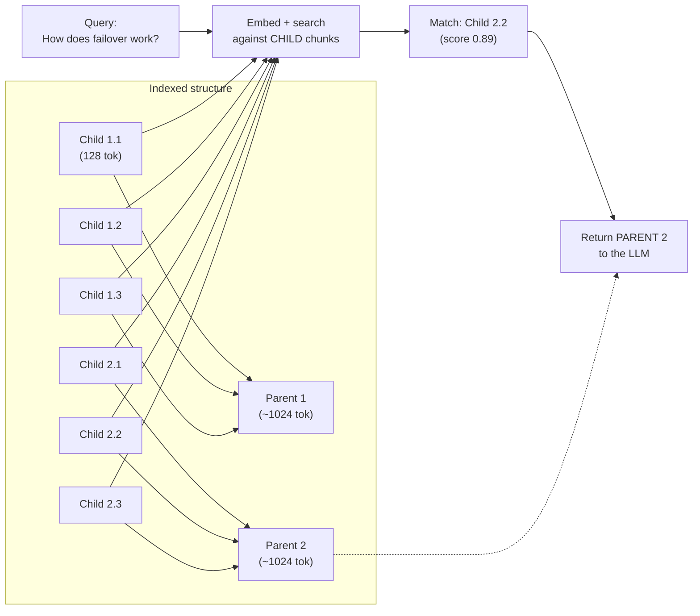

# Parent-Child Retrieval: Retrieve Small, Return Large

**Core insight**: small chunks are better for matching, but large chunks are better for answering.

### How It Works

1. **Index small chunks** (128-256 tokens) for precise semantic matching
2. **Store parent references**: each child chunk links to its parent (the full section or document)
3. **At query time**: search against child chunks, but return the parent chunk to the LLM
4. The LLM gets the full context surrounding the matched passage

### Variations

- **Sentence window**: retrieve the matching sentence, expand to +/- N surrounding sentences
- **Section-level parents**: children are paragraphs, parents are full sections
- **Document summary + chunks**: store a summary of the whole document as metadata; include it alongside retrieved chunks

### Benefits

- Precise retrieval (small chunks match better)
- Rich context for generation (large chunks provide better answers)
- Reduces "out of context" hallucinations from truncated chunks
