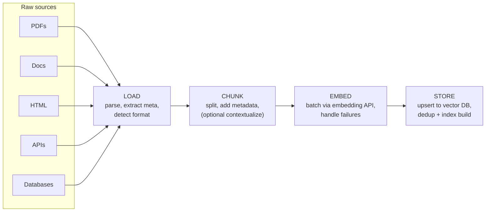

# Designing the Ingestion Pipeline

The ingestion pipeline transforms raw documents into a searchable knowledge base. Every production RAG system needs one.

### Stage Details

| Stage | Tools | Key Decisions |
|-------|-------|--------------|
| **Load** | Unstructured.io, LlamaParse, PyMuPDF, Docling | Format detection, OCR for scanned docs, table extraction |
| **Chunk** | LangChain splitters, LlamaIndex node parsers, custom | Strategy, size, overlap, metadata preservation |
| **Embed** | OpenAI API, Cohere API, sentence-transformers | Model choice, batch size, dimensionality, error handling |
| **Store** | Pinecone, Qdrant, pgvector, Weaviate | Upsert logic, deduplication, index configuration |

### Production Concerns

- **Idempotency**: re-running the pipeline should not create duplicates (use content hashes)
- **Incremental updates**: process only new/changed documents, not the entire corpus
- **Error handling**: log failures per-document, don't let one bad PDF kill the entire run
- **Monitoring**: track chunk counts, embedding latencies, storage utilization
- **Versioning**: when you change chunking or embedding models, you need to re-index everything

## Sources

- [Unstructured — Open-source ETL for Document Processing (Unstructured.io)](https://github.com/Unstructured-IO/unstructured)
- [LlamaParse — AI Document Parsing (LlamaIndex)](https://www.llamaindex.ai/llamaparse)
- [LlamaIndex Documentation](https://developers.llamaindex.ai/)
- [LangChain Text Splitters (LangChain)](https://reference.langchain.com/python/langchain-text-splitters/character/RecursiveCharacterTextSplitter)
- [OpenAI Embeddings API (OpenAI)](https://platform.openai.com/docs/guides/embeddings)
- [Cohere Embed Models (Cohere)](https://docs.cohere.com/docs/embeddings)
- [Pinecone Documentation (Pinecone)](https://docs.pinecone.io)
- [Weaviate Documentation (Weaviate)](https://weaviate.io/developers/weaviate)
