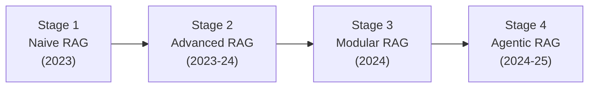

# The Evolution of RAG

## Stage 1: Naive RAG (2023)

- Single-pass retrieve-then-read
- Fixed top-k chunks concatenated into prompt
- No quality checks on retrieved context
- Works for simple factoid lookup; breaks on complex queries

## Stage 2: Advanced RAG (2023-2024)

- Pre-retrieval: query rewriting, HyDE, step-back prompting
- Retrieval: hybrid search, reranking, metadata filtering
- Post-retrieval: context compression, redundancy removal
- Significant gains in retrieval precision

## Stage 3: Modular RAG (2024)

- Decomposed pipeline with interchangeable components
- Routing queries to specialized retrieval strategies
- Pluggable retrievers, generators, and evaluators
- Enables experimentation and A/B testing

## Stage 4: Agentic RAG (2024-2025)

- LLM-as-orchestrator decides retrieval strategy at runtime
- Self-correcting loops: evaluate, retry, decompose
- Multi-source retrieval with tool use
- Adaptive behavior based on query complexity and retrieval confidence

## Sources

- [Retrieval-Augmented Generation for Knowledge-Intensive NLP Tasks (Lewis et al., 2020)](https://arxiv.org/abs/2005.11401)
- [Precise Zero-Shot Dense Retrieval without Relevance Labels / HyDE (Gao et al., 2022)](https://arxiv.org/abs/2212.10496)
- [Take a Step Back: Evoking Reasoning via Abstraction in LLMs (Zheng et al., 2023)](https://arxiv.org/abs/2310.06117)
- [Corrective Retrieval Augmented Generation / CRAG (Yan et al., ICLR 2024)](https://arxiv.org/abs/2401.15884)
- [Self-RAG: Learning to Retrieve, Generate, and Critique (Asai et al., ICLR 2024)](https://arxiv.org/abs/2310.11511)
- [Adaptive-RAG (Jeong et al., NAACL 2024)](https://arxiv.org/abs/2403.14403)
