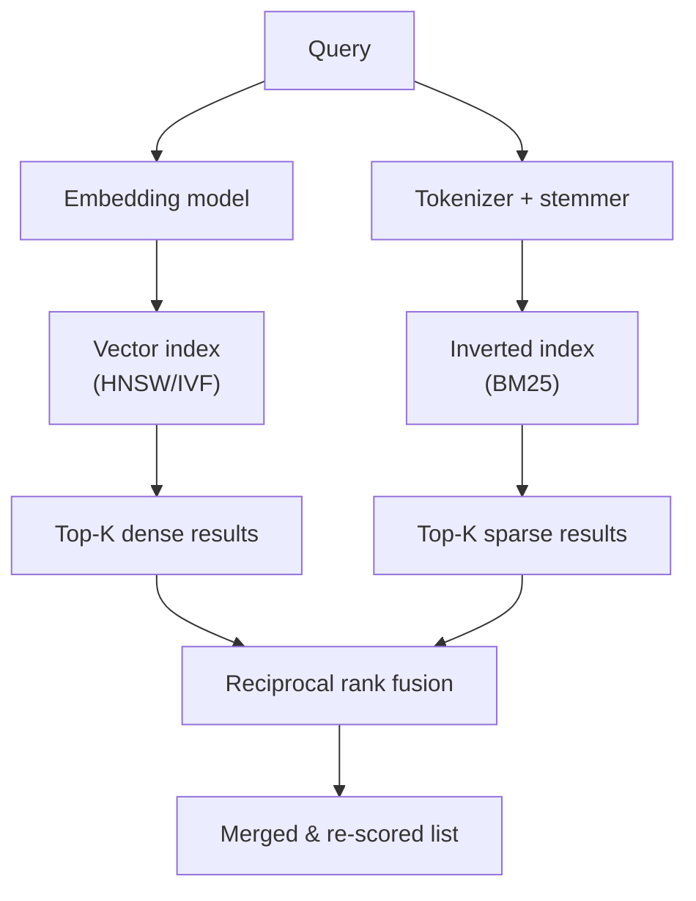

# Hybrid Search: Vector + BM25 + Reciprocal Rank Fusion



**Reciprocal Rank Fusion (RRF)**

```
RRF_score(d) = SUM[ 1 / (k + rank_i(d)) ]   for each ranker i
```

- `k` is a constant (typically 60) that dampens the impact of high-ranking outliers
- Documents appearing in multiple result lists get boosted
- No score normalization needed -- works directly on rank positions
- Outperforms linear score combination in practice (Cormack et al., 2009)

## Sources

- [Reciprocal Rank Fusion Outperforms Condorcet and Individual Rank Learning Methods (Cormack et al., SIGIR 2009)](https://cormack.uwaterloo.ca/cormacksigir09-rrf.pdf)
