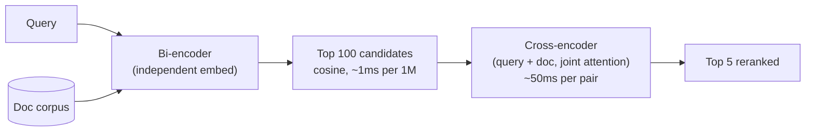

# Cross-Encoder Reranking: Second-Pass Precision

**Why two passes?**

- Bi-encoders are fast but encode query and document independently -- no cross-attention
- Cross-encoders jointly process query + document through full transformer attention
- Cross-encoders are 100-1000x slower but significantly more accurate
- Typical pipeline: retrieve 100 with bi-encoder, rerank top 20 with cross-encoder

> **Now a near-mandatory production stage.** A cross-encoder reranker after retrieval and before generation is standard in 2026 RAG. Hosted options like Pinecone Inference and Cohere Rerank fold reranking into the retrieval service, removing the need to self-host a reranker.

**Production rerankers**

| Model | Parameters | NDCG@10 (BEIR) | Latency (20 docs) |
|-------|-----------|-----------------|-------------------|
| Cohere Rerank v3 | Proprietary | 59.2 | ~120ms (API) |
| bge-reranker-v2-m3 | 568M | 57.4 | ~80ms (GPU) |
| ms-marco-MiniLM-L-12 | 33M | 49.1 | ~15ms (GPU) |
| ColBERT v2 (late interaction) | 110M | 54.6 | ~5ms (GPU) |

## Sources

- [ColBERTv2: Effective and Efficient Retrieval via Lightweight Late Interaction (Santhanam et al., NAACL 2022)](https://arxiv.org/abs/2112.01488)
- [BEIR: A Heterogeneous Benchmark for Zero-shot Evaluation of IR Models (Thakur et al., NeurIPS 2021)](https://arxiv.org/abs/2104.08663)
- [Cohere Rerank Documentation](https://docs.cohere.com/docs/rerank-2)
- [BGE Reranker Models (BAAI)](https://huggingface.co/BAAI/bge-reranker-v2-m3)
- [Top Vector Databases for LLM Applications — Reranking as a Standard Stage (Second Talent)](https://www.secondtalent.com/resources/top-vector-databases-for-llm-applications/)
