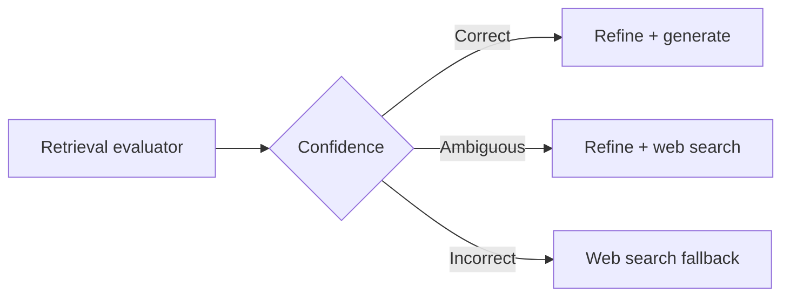

# Corrective RAG (CRAG)

**Paper** -- Yan et al., "Corrective Retrieval Augmented Generation" (ICLR 2024)

**Core idea** -- Embed self-evaluation of retrieved documents *before* generation. If the evidence is weak, re-query or fall back to web search rather than generating from bad context. This is a 2026 default for high-stakes domains where hallucinations are unacceptable.

**Three retrieval confidence levels**

- **Correct** -- At least one retrieved document is highly relevant. Proceed to generation with knowledge refinement to strip irrelevant sentences.
- **Incorrect** -- All retrieved documents are irrelevant. Discard them entirely and fall back to web search for fresh, relevant context.
- **Ambiguous** -- Some documents are marginally relevant. Combine refined internal retrieval results with supplementary web search results.

**Lightweight retrieval evaluator** -- A fine-tuned T5-Large model scores each retrieved document as relevant or irrelevant given the query. This is cheaper than using the main LLM for evaluation.

**Knowledge refinement** -- Decompose each relevant document into fine-grained knowledge strips (sentence-level). Score each strip independently and discard irrelevant ones. This eliminates noise within documents, not just across documents.

**Results** -- CRAG improves over standard RAG by 5-10% on PopQA, Biography, and PubQA benchmarks, with the largest gains on queries where naive retrieval returns poor results.

## Sources

- [Corrective Retrieval Augmented Generation (Yan et al., ICLR 2024)](https://arxiv.org/abs/2401.15884)
- [RAG in 2026: A Practical Blueprint for Retrieval-Augmented Generation (dev.to)](https://dev.to/suraj_khaitan_f893c243958/-rag-in-2026-a-practical-blueprint-for-retrieval-augmented-generation-16pp)
