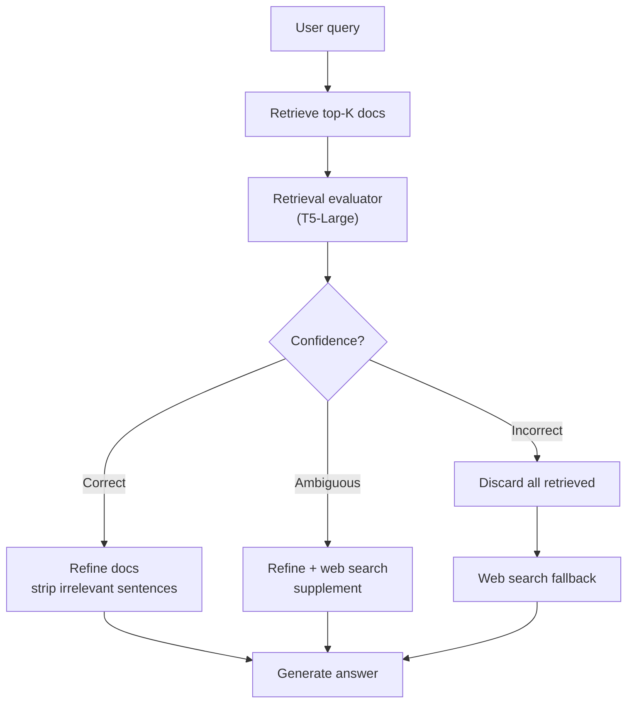
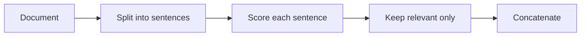

# CRAG Execution Flow

**Knowledge refinement (strip-level filtering)**

Each sentence is independently evaluated for relevance to the original query. Irrelevant sentences within otherwise-relevant documents are discarded before generation.

## Sources

- [Corrective Retrieval Augmented Generation (Yan et al., ICLR 2024)](https://arxiv.org/abs/2401.15884)
