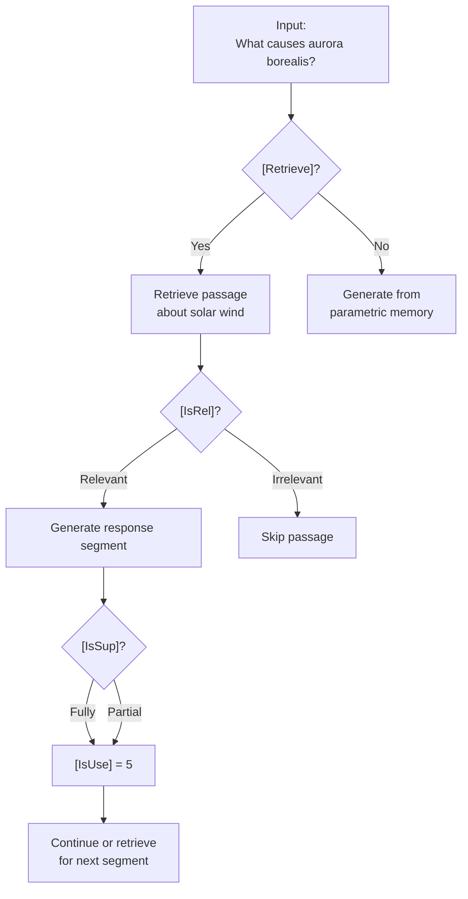

# Self-RAG Reflection Tokens

```
Token          Purpose                        Values
========================================================================
[Retrieve]     Should I retrieve?             { Yes, No, Continue }
[IsRel]        Is passage relevant to query?  { Relevant, Irrelevant }
[IsSup]        Is generation supported?       { Fully, Partially, None }
[IsUse]        Is response useful overall?    { 5, 4, 3, 2, 1 }
```

**Generation flow with reflection tokens**



**Inference-time control** -- By adjusting thresholds on [IsSup] and [IsUse] scores, you can trade off between:

- **High precision** (strict thresholds): only output claims fully supported by evidence
- **High recall** (relaxed thresholds): allow partially supported claims for broader coverage
- **No retrieval** (force [Retrieve=No]): use the model as a standard LM

## Sources

- [Self-RAG: Learning to Retrieve, Generate, and Critique through Self-Reflection (Asai et al., ICLR 2024)](https://arxiv.org/abs/2310.11511)
