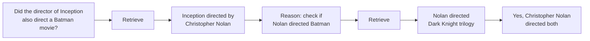

# Multi-Step Retrieval: Iterative Refinement of Context

**Problem** -- Complex queries cannot be answered by a single retrieval pass. Multi-hop questions require chaining information across documents, where the answer to one sub-question determines what to retrieve next.

**IRCoT (Interleaving Retrieval with Chain-of-Thought)**

Alternate between generating reasoning steps and retrieving new evidence. Each reasoning step may surface new entities or concepts that trigger a fresh retrieval.

**ITER-RETGEN (Iterative Retrieval-Generation)**

Alternate between retrieval and generation for a fixed number of iterations. Each generation provides additional context that improves the next retrieval query.

**Practical implementation pattern**

1. Retrieve initial context with the original query
2. Generate a draft answer or reasoning chain
3. Extract key entities and claims from the draft
4. Formulate follow-up queries for missing information
5. Retrieve additional context
6. Generate the final answer with the full aggregated context

**When to use multi-step** -- Multi-hop questions, comparison queries, queries requiring temporal reasoning, and any question where the required context is spread across documents that would not all surface in a single retrieval pass.

**Cost consideration** -- Each retrieval step adds latency and API cost. Limit iteration depth (typically 2-4 rounds) and use early stopping when confidence is sufficient.

## Sources

- [Interleaving Retrieval with Chain-of-Thought Reasoning / IRCoT (Trivedi et al., ACL 2023)](https://arxiv.org/abs/2212.10509)
- [Enhancing Retrieval-Augmented LLMs with Iterative Retrieval-Generation Synergy / ITER-RETGEN (Shao et al., EMNLP 2023)](https://arxiv.org/abs/2305.15294)
