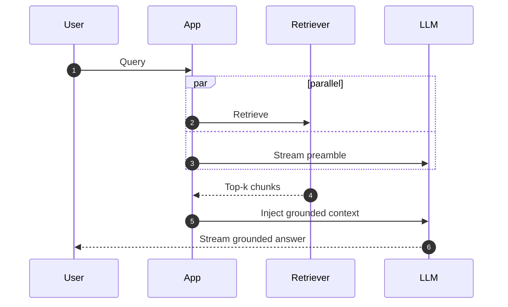

# Streaming RAG: Real-Time Retrieval in Conversational Systems

**Challenge** -- Users expect sub-second response times in chat interfaces. Standard RAG adds 500ms-3s of retrieval latency before the first token appears. In multi-turn conversations, this compounds with conversation history management.

**Streaming architecture**

1. **Parallel retrieval + first-token generation** -- Begin generating a preamble ("Let me look into that...") while retrieval executes in parallel. Replace with grounded content once results arrive.

2. **Speculative retrieval** -- Pre-fetch likely-needed context based on conversation trajectory before the user finishes typing. Cache results for immediate use.

3. **Incremental context injection** -- Start generating with initial results, then inject additional context as reranking and secondary retrievals complete.

**Conversation memory for RAG**

- **Query contextualization** -- Rewrite the current query to be self-contained by incorporating relevant conversation history. "What about their revenue?" becomes "What is Nvidia's revenue for Q3 2025?"
- **Sliding window** -- Keep the last N turns in the retrieval query for context
- **Summary buffer** -- Maintain a running summary of the conversation for long sessions

**Latency budget for production chat RAG**

| Component | Target | Technique |
|-----------|--------|-----------|
| Embedding | <50ms | Cached models, batching |
| Vector search | <30ms | ANN index, pre-filtering |
| BM25 search | <10ms | Inverted index in memory |
| Reranking | <100ms | Distilled cross-encoder |
| LLM first token | <300ms | Streaming, speculative decode |
| **Total TTFT** | **<500ms** | **Parallel execution** |
