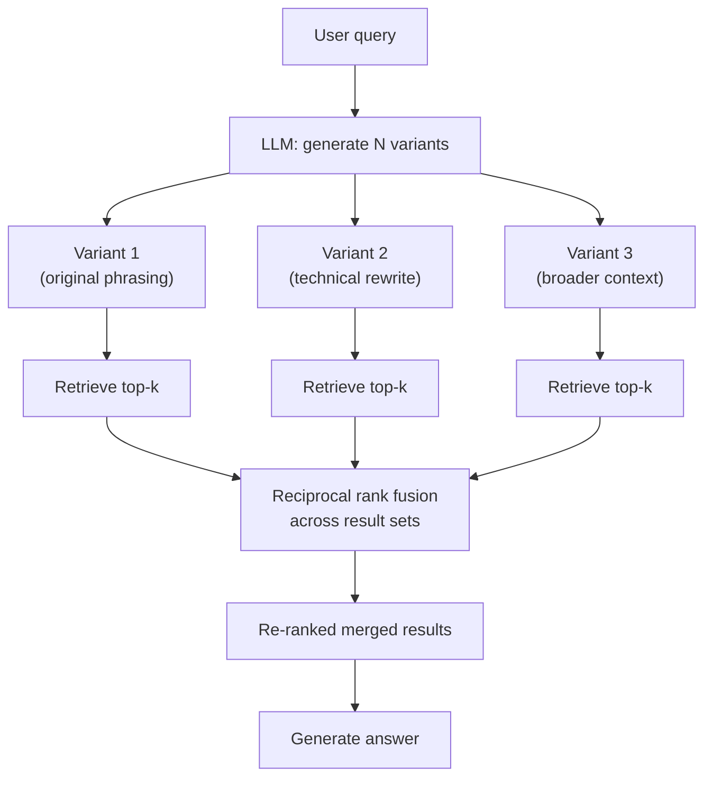

# RAG-Fusion: Multiple Query Variants, Merged Results

**Paper** -- Rackauckas (2023), inspired by Reciprocal Rank Fusion research



**Why it works** -- Different phrasings of the same question activate different regions of the embedding space and match different keyword patterns. Merging via RRF surfaces documents that are consistently relevant across multiple query interpretations.

**Query variant generation prompt**

```
Given this query, generate 3 different search queries that
would help find relevant information. Vary the specificity,
terminology, and angle of each variant.
```

**Trade-off** -- N query variants means N retrieval calls. Typically N=3-5 provides the best cost-quality ratio. Beyond that, diminishing returns.

## Sources

- [RAG-Fusion: A New Take on Retrieval-Augmented Generation (Rackauckas, 2024)](https://arxiv.org/abs/2402.03367)
- [Reciprocal Rank Fusion Outperforms Condorcet and Individual Rank Learning Methods (Cormack et al., SIGIR 2009)](https://cormack.uwaterloo.ca/cormacksigir09-rrf.pdf)
