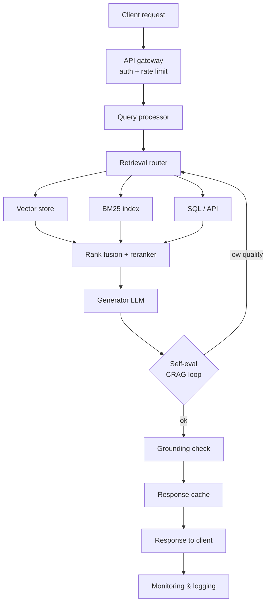

# Production RAG Pipeline Architecture

**Key architectural decisions**

- **Retrieval router** decides which backends to query based on query classification
- **Response cache** (semantic similarity cache) avoids re-processing near-duplicate queries
- **Self-eval loop** feeds back into retrieval if quality is below threshold
- **Grounding check** runs in parallel with response streaming where possible
- **Every component emits structured logs** for observability and debugging
