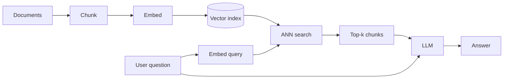

# Where We Came From

Vector RAG retrieves text chunks whose **embeddings are closest** to the query. This works well when:

- The answer lives in a few specific passages
- The user's wording is close to the document's wording
- The corpus is large enough that semantic similarity is meaningful

## What it ignores

A vector index treats the corpus as a **bag of chunks**. It throws away:

- **Relationships between entities** ("Acme Corp is owned by ConsolidatedCo") that span chunks
- **The corpus structure** — folder hierarchy, citation graph, version history, threaded conversation
- **Aggregate properties** that require reading many chunks together ("how many engineers left in Q3?")

For point lookups, this is fine. For questions that require *connecting* facts or *summarizing* a slice of the corpus, it falls down. That's where GraphRAG fits.

## The benchmark numbers behind the hype

Microsoft's GraphRAG paper [Edge et al. 2024](https://arxiv.org/abs/2404.16130) reports **+20–80% comprehensiveness** vs naive RAG on query-focused summarization tasks (using LLM-as-judge). LightRAG ([Guo et al. 2024](https://arxiv.org/abs/2410.05779)) shows similar gains at lower cost. Both compare against well-tuned RAG baselines, not strawmen.

Sources

- [Lewis et al. — original RAG (2020)](https://arxiv.org/abs/2005.11401)
- [Edge et al. — GraphRAG paper](https://arxiv.org/abs/2404.16130)
- [Anthropic — Contextual Retrieval blog (2024)](https://www.anthropic.com/news/contextual-retrieval)
