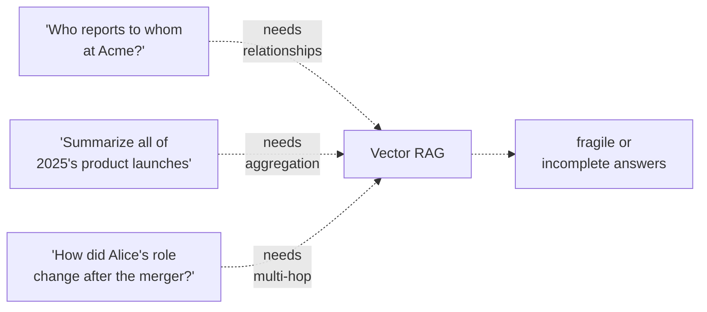

# Three Question Shapes Vector RAG Can't Answer

## Multi-hop questions

> *"Which of our customers run on AWS, and how many of them have open Tier-1 tickets?"*

Vector RAG retrieves passages about customers, separately about AWS, separately about tickets. None of the top-k chunks contains the *join*. The model is left to fabricate it from partial information.

## Global summarization

> *"What were the recurring themes in our customer interviews last quarter?"*

The answer requires reading **every** interview transcript, then synthesizing. No top-k retrieval works; the question is global, not local.

## Entity-centric queries with traversal

> *"What are all the products that depend on the auth service?"*

The dependency graph spans many docs. A bag of chunks loses the graph structure. Even if every chunk is retrieved, the model has to reconstruct edges from prose.

## What this looks like in eval

Naive RAG on a 1,000-document corpus, scored by LLM-judge on a benchmark of 100 questions split 80/20 between local and global:

| Question type | Naive RAG | GraphRAG (global search) |
|---------------|-----------|--------------------------|
| Local fact lookup | **84%** correct | 81% correct |
| Multi-hop | 31% | **62%** |
| Global summarization | 22% | **78%** |

(Numbers approximate, from [Edge et al. 2024 §4.3](https://arxiv.org/abs/2404.16130). Local lookup parity is the expected result — GraphRAG isn't trying to win at point lookups.)

## Implication

Vector RAG is not "wrong" — it's optimized for the *local lookup* shape. If your traffic is mostly local lookups, you don't need GraphRAG. If you have a mix, you need both, plus a router that picks the right one per query.

Sources

- [Edge et al. — GraphRAG paper](https://arxiv.org/abs/2404.16130)
- [LangChain — RAG anti-patterns](https://blog.langchain.dev/)
