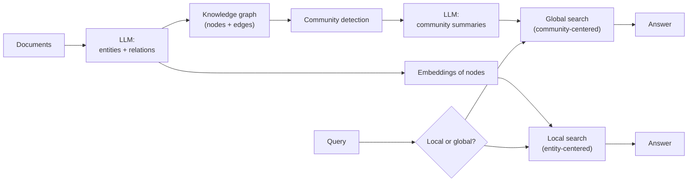

# Index the Graph, Not Just the Chunks

GraphRAG augments — or replaces — the vector index with a **structured knowledge graph**. Entities become nodes; the relationships between them become edges. Retrieval can now traverse the graph, not just look up nearest neighbors in an embedding space.

## What the LLM does at index time

A GraphRAG pipeline uses an LLM **at indexing**, not just at retrieval. For each chunk:

1. **Extract entities** — people, orgs, products, files, dates, anything domain-specific (a configurable taxonomy)
2. **Extract relations** — "Alice manages Bob", "Postgres is a dependency of OrderService", "Q3 launch postponed Q4 launch"
3. **Generate descriptions** — for each entity and relation, a short summary the system can search against later

This is expensive: many LLM calls during indexing. The payoff is that retrieval is **cheap and structured** — a graph traversal rather than a re-embedding cascade.

## What the structure gives you

| Capability | Vector RAG | GraphRAG |
|------------|------------|----------|
| Point lookup | ✅ | ✅ (via node embedding) |
| Multi-hop | ❌ | ✅ (graph traversal) |
| Global summary | ❌ | ✅ (community summaries) |
| Entity-centric drill-down | ❌ | ✅ (node + neighbors) |
| Schema-free | ✅ | ✅ (LLM-extracted) |
| Cheap to index | ✅ | ❌ (LLM-heavy) |
| Cheap to update | ✅ | ❌ (re-extract affected entities) |

## What's *not* new

The idea of indexing entities and relations predates LLMs by decades (ontology-based retrieval, semantic networks). What's new is that **LLMs can do the extraction** for free-form text — no schema, no NER training, no hand-coded rules.

Sources

- [Edge et al. — GraphRAG paper](https://arxiv.org/abs/2404.16130)
- [microsoft/graphrag — reference implementation](https://github.com/microsoft/graphrag)
