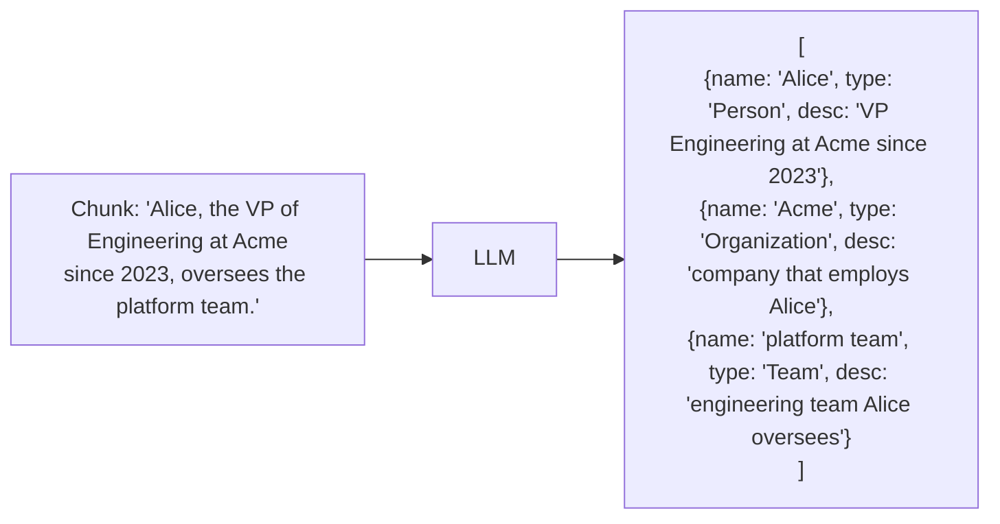

# Turning Chunks Into Nodes

The first stage of the indexing pipeline. For each chunk, an LLM extracts named entities and their (optionally) typed attributes.



## The extraction prompt (simplified)

```python
EXTRACTION_PROMPT = """
Extract entities and their relationships from the text below.

Entity types to look for: {entity_types}

For each entity, output:
- name: the canonical name
- type: from the list above
- description: one sentence summarizing what the text says about this entity

For each relationship between two entities in this chunk, output:
- source, target: entity names
- description: how they are related (from the text)
- weight: 1-10 strength

Output JSON. Do not invent entities not mentioned in the text.

TEXT:
{chunk}
"""
```

A real pipeline ([microsoft/graphrag](https://github.com/microsoft/graphrag)) adds:

- A **gleaning loop** — after the first pass, ask the model "did you miss any?" up to N times to catch entities mentioned in passing
- **Consistency checks** — entities and relations must be grounded in the text, not invented
- **A configurable taxonomy** — entity types specific to the domain (`Patent`, `Compound`, `Trial` for a pharma corpus; `Repo`, `PR`, `Author` for an engineering corpus)

## Cost anatomy

Extracting from a 1M-token corpus with Claude Haiku at $1/M input + $5/M output:
- Input: 1M tokens × $1 = **$1**
- Output: ~30k tokens (the extracted JSON) × $5 = **$0.15**
- With one round of gleaning: roughly 1.5×

So **~$1.50–$2 per 1M tokens** with Haiku — cheap enough that re-indexing a corpus weekly is not unreasonable.

## Pitfalls

- **Hallucinated entities** — the model "remembers" entities from training data. Mitigate by requiring the model to quote the source span
- **Coreference** — "Alice" in chunk 12 and "she" in chunk 14 are the same person. A naive extractor produces two entities; a deduplication pass fixes it (next slide)
- **Granularity drift** — different chunks extract the same entity at different levels of detail. Resolved at the merging stage

Sources

- [microsoft/graphrag — extraction prompts & source](https://github.com/microsoft/graphrag)
- [Edge et al. — §3.1 Source Documents → Text Chunks → Element Instances](https://arxiv.org/abs/2404.16130)
