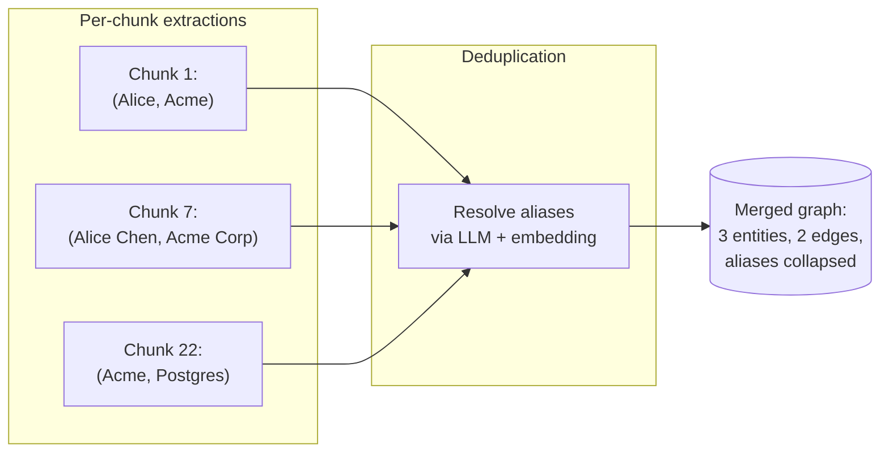

# Merging Local Extractions Into One Graph

Each chunk produces its own little entity-and-relation dump. The graph-construction stage merges all of those into a single global graph.



## The merging steps

### 1. Normalize names

`Alice` ≈ `Alice Chen` ≈ `A. Chen` — resolve to one canonical entity. Two signals:

- **String similarity** (Levenshtein, Jaro-Winkler) for obvious typo and abbreviation matches
- **Embedding similarity** on the entity descriptions for semantic matches ("VP of Eng" vs "VP Engineering")
- **LLM judge** as the tiebreaker for ambiguous cases ("Is 'Apple Inc' in chunk 12 the same as 'Apple' in chunk 88?")

### 2. Merge descriptions

When two chunks describe the same entity, the system **summarizes both descriptions into one** via an LLM call. The merged description preserves the union of facts, drops duplication.

### 3. Aggregate edge weights

If chunks 1, 5, and 22 all assert "Alice manages Bob", the edge gets `weight = 3` (or whatever weighting scheme — sum, max, average).

## What the merged graph looks like

```python
# Pseudocode of the resulting structure
graph = {
  "nodes": {
    "Alice": {"type": "Person", "description": "VP Engineering at Acme since 2023, oversees platform team",
              "source_chunks": [1, 7, 14, 22]},
    "Acme":  {"type": "Org",    "description": "Software company; employs ~500; uses Postgres",
              "source_chunks": [1, 7, 22, 31]},
    ...
  },
  "edges": [
    {"source": "Alice", "target": "Acme", "rel": "works_at", "weight": 3, "source_chunks": [1, 7, 14]},
    {"source": "Acme",  "target": "Postgres", "rel": "uses",  "weight": 1, "source_chunks": [22]},
    ...
  ]
}
```

## Why the deduplication step is load-bearing

Skip it and you get **graph fragmentation**: 18 versions of "Alice", each with one edge — none of which can answer "how many people does Alice manage?". Most of the lift in GraphRAG comes from this stage being well-tuned.

Sources

- [Edge et al. — §3.2 Element Summaries](https://arxiv.org/abs/2404.16130)
- [LightRAG — entity merging via embedding similarity](https://arxiv.org/abs/2410.05779)
