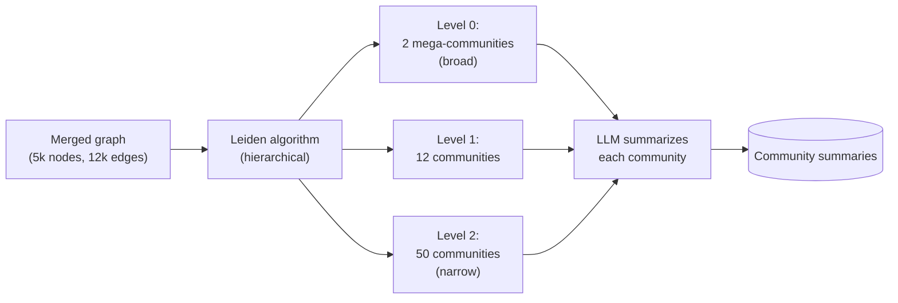

# Finding Clusters in the Graph

A merged knowledge graph for a real corpus has thousands of nodes. To make global queries tractable, GraphRAG runs **community detection** — partitioning the graph into densely-connected clusters that an LLM can summarize one at a time.

## Why Leiden, not spectral or k-means

The reference GraphRAG pipeline uses the [**Leiden algorithm**](https://www.nature.com/articles/s41598-019-41695-z) ([Traag, Waltman, van Eck 2019](https://www.nature.com/articles/s41598-019-41695-z)). Three reasons:

- **Hierarchical output** — Leiden naturally produces a tree of communities at multiple granularities. GraphRAG uses this directly to let queries pick the "level of zoom" they need
- **Resolution parameter** — tunable to taste; lower resolution = bigger communities, higher = smaller
- **Quality and speed** — strict improvement over the older Louvain algorithm in both modularity and runtime

A typical run on a 5k-node graph: hundreds of milliseconds, producing 3 levels with 2 / 12 / 50 communities.

## Summarizing each community

For every community at every level, an LLM is asked:

> *Here is a community of N entities and the relations among them. Produce a 1–2 paragraph summary describing what this community is about, the main entities, and notable relationships.*

The output is stored alongside the graph. At query time, **global search retrieves over these summaries**, not over the original chunks.

## Cost

Community summarization runs roughly **once per (community × level)**. For 64 total communities across 3 levels, ~64 LLM calls totaling a few thousand input tokens each. With Haiku, **single-digit dollars for the whole pass**.

## Tunable knobs

- **Resolution** — controls cluster size; defaults work for most corpora
- **Levels to summarize** — usually 2–3 is enough; deeper levels are diminishing returns
- **Summary length** — longer summaries cost more at retrieval; shorter risk losing nuance
- **Min community size** — too-small communities are noise; drop those below ~5 nodes

Sources

- [Traag et al. — Leiden algorithm (2019)](https://www.nature.com/articles/s41598-019-41695-z)
- [Edge et al. — §3.3–3.4 Graph Communities → Community Summaries](https://arxiv.org/abs/2404.16130)
