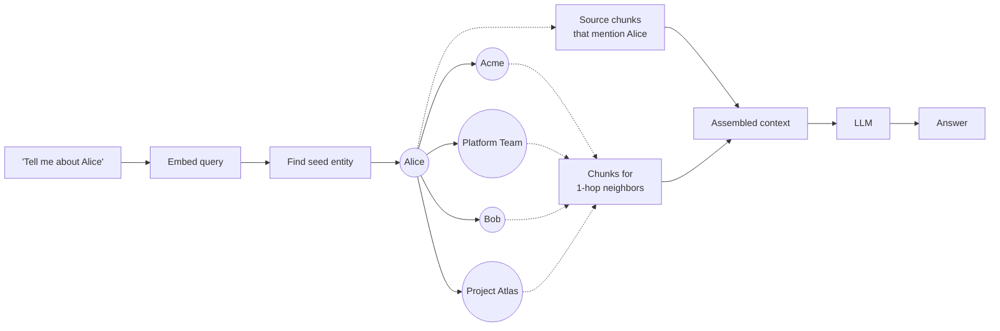

# Entity-Centered Retrieval

**Local search** answers questions about a specific entity by gathering everything the graph knows about that entity and its immediate neighbors.



## What goes into the context window

For a local query, the retriever assembles roughly:

1. **Description of the seed entity** itself
2. **Descriptions of 1-hop neighbors** (and optionally 2-hop, weighted by edge strength)
3. **Edge descriptions** along the path between seed and neighbor
4. **A handful of source chunks** that mention any of the above (back-references)

All ranked by relevance, packed into the available context budget.

## Code sketch

```python
def local_search(query: str, graph, embedder, llm) -> str:
    # 1. Find seed entity by embedding similarity
    seed = embedder.nearest_node(query, top_k=1)

    # 2. Expand to neighbors
    neighbors = graph.neighbors(seed.id, max_hops=2, max_count=20)

    # 3. Gather supporting chunks
    chunk_ids = set(seed.source_chunks)
    for n in neighbors:
        chunk_ids.update(n.source_chunks)
    chunks = fetch_chunks(chunk_ids, limit=10)

    # 4. Assemble + answer
    context = format_local_context(seed, neighbors, chunks)
    return llm.generate(query=query, context=context)
```

## When local search shines

- "Who is X?" or "What does X do?"
- "What are the dependencies of Y?"
- "What's wrong with project Z?" (recent issues, blockers, etc. that link to Z)

## When it falls short

- "What are the recurring themes across all the X?" — this is global, not local
- Questions where the model doesn't know the right seed entity from the wording (e.g., "the issue we hit last sprint" — fuzzy reference)

For the second case, hybrid retrieval (next section) helps: combine an embedding-based fallback with the graph traversal.

Sources

- [Edge et al. — §4.2 Local Search](https://arxiv.org/abs/2404.16130)
- [microsoft/graphrag — local search implementation](https://github.com/microsoft/graphrag)
