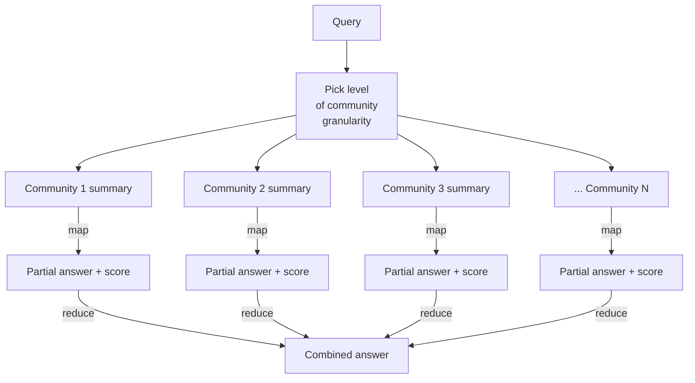

# Map-Reduce Over Community Summaries

**Global search** answers corpus-wide questions ("what are the main themes?") by asking the LLM to answer the query *against each community summary*, then combining the partial answers.



## The two-pass pattern

### Map pass

For each community summary at the chosen level, run the LLM:

```
You are answering the user's question using only the community summary below.
If the summary is not relevant, say so. If it is, produce a partial answer
and rate the partial answer's helpfulness on a scale of 1-100.

QUESTION: {query}
COMMUNITY SUMMARY: {summary}
```

This is parallelizable — N communities, N independent LLM calls.

### Reduce pass

Filter to the top-K partial answers by self-rating, then ask the LLM to synthesize:

```
You will combine the partial answers below into one final answer.
Resolve contradictions in favor of more recent / more specific information.
Cite which community each fact came from.

QUESTION: {query}
PARTIAL ANSWERS:
- [Community 3, score 87]: ...
- [Community 12, score 76]: ...
```

## Cost characterization

For a corpus that produced 50 communities at the chosen level, a global query costs **~50 small LLM calls** in the map pass plus one larger call in the reduce pass.

With Claude Haiku and a few-hundred-token average summary, a global query costs roughly **$0.05–$0.20** depending on community count. Not free; not nothing. Reserve it for queries that actually need it.

## Picking the level

| Question shape | Use level |
|----------------|-----------|
| "What are the broad themes?" | Top (Level 0) — handful of mega-communities |
| "What did each team focus on?" | Middle (Level 1) |
| "What did the platform team focus on?" | Bottom (Level 2) — narrower, more specific |

A query router or the user's choice picks the level. Some implementations let the model choose by retrieving summaries at multiple levels and picking the most useful.

Sources

- [Edge et al. — §4.1 Global Search](https://arxiv.org/abs/2404.16130)
- [microsoft/graphrag — global search implementation](https://github.com/microsoft/graphrag)
