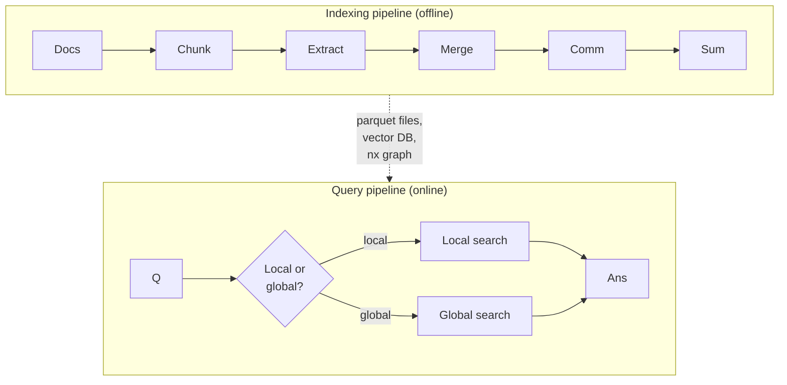

# The Reference Implementation

[microsoft/graphrag](https://github.com/microsoft/graphrag) is the canonical implementation of the [Edge et al. 2024](https://arxiv.org/abs/2404.16130) paper — open source, Python, batteries-included.



## What you get out of the box

- **Indexing CLI** — `graphrag index --root ./project` runs the whole extraction → merge → community → summarization pipeline, configurable via YAML
- **Query CLI** — `graphrag query --method local "..."` or `--method global "..."`
- **Configurable LLMs** — OpenAI, Azure OpenAI, Anthropic, local Ollama via standard adapters
- **Configurable storage** — Parquet on disk by default; LanceDB, Azure Cosmos DB, or your own backend
- **Observability hooks** — every LLM call is logged and replayable

## Typical configuration

```yaml
# settings.yaml
llm:
  type: openai_chat
  model: gpt-4o-mini      # or claude-sonnet-4-6 via adapter
  api_key: ${OPENAI_API_KEY}

embeddings:
  llm:
    type: openai_embedding
    model: text-embedding-3-large

entity_extraction:
  entity_types: [Person, Organization, Product, Location]
  max_gleanings: 1

community_reports:
  max_length: 2000

cluster_graph:
  max_cluster_size: 10
```

## What it does well

- **Reproducibility** — outputs of every pipeline stage are versioned parquet files; you can re-run only the stage you changed
- **Eval baseline** — the repo ships with the eval harness from the paper, so you can compare your changes against the published numbers
- **Drop-in answer quality** — for global queries, "just run microsoft/graphrag with defaults" is already a strong baseline

## What it does poorly

- **Cost** — the full pipeline on a non-trivial corpus is dollars-to-tens-of-dollars, not cents. You'll feel it
- **Latency** — indexing a Wikipedia-sized corpus is hours, not minutes
- **Hot updates** — adding a new document means re-running affected entity extraction, then re-merging; no first-class "incremental insert"

These limitations are what spawned the next wave: LightRAG, LazyGraphRAG, LinearRAG, and others.

Sources

- [microsoft/graphrag](https://github.com/microsoft/graphrag)
- [Edge et al. — GraphRAG paper](https://arxiv.org/abs/2404.16130)
